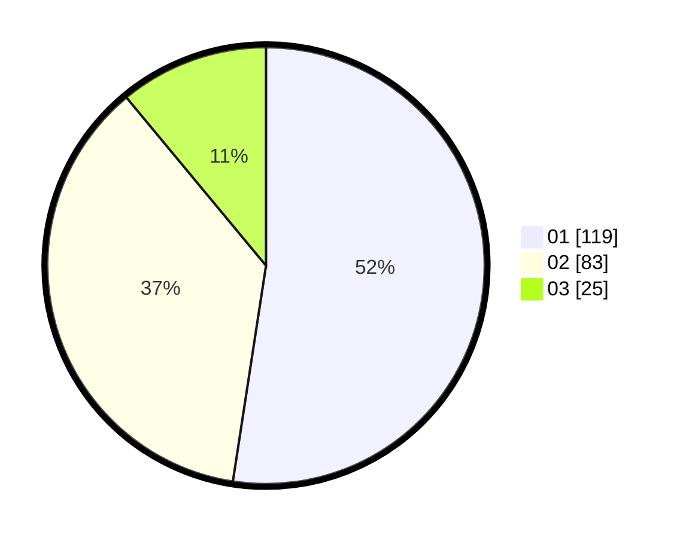

# Hasil

Hasil perolehan suara paslon dapat dilihat pada file paslon-01.txt, paslon-02.txt, dan paslon-03.txt.

Jika tidak ada, artinya data tersebut belum ada pada SIREKAP.

## Perolehan Suara

 * Paslon 01: **119**.
 * Paslon 02: **83**.
 * Paslon 03: **25**.

## Foto C Plano

https://sirekap-obj-formc.kpu.go.id/8fab/pemilu/ppwp/31/73/06/10/02/3173061002144-20240214-215045--539846f3-6170-4acd-8bf5-40f19c8dc641.jpg

https://sirekap-obj-formc.kpu.go.id/8fab/pemilu/ppwp/31/73/06/10/02/3173061002144-20240214-214730--ebe6c5d7-72bd-4a0b-9038-97d344ec8080.jpg

https://sirekap-obj-formc.kpu.go.id/8fab/pemilu/ppwp/31/73/06/10/02/3173061002144-20240214-214819--01ef1357-6077-4c1d-8dfe-ce63cb3cd791.jpg
