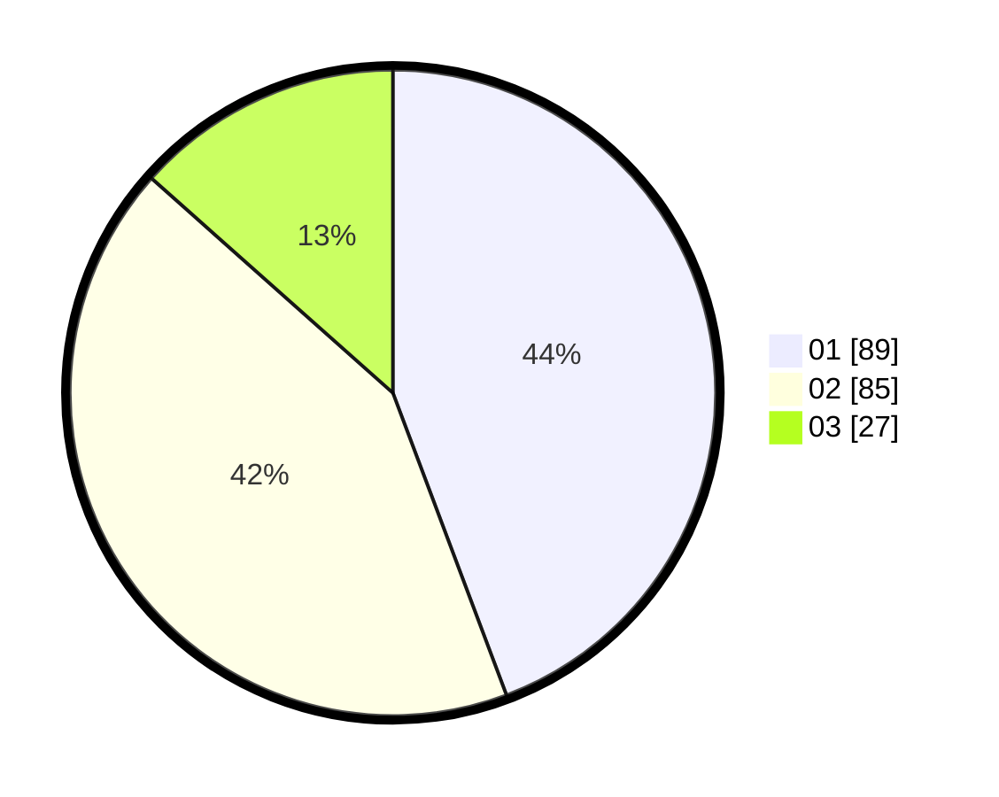

# Hasil

Hasil perolehan suara paslon dapat dilihat pada file paslon-01.txt, paslon-02.txt, dan paslon-03.txt.

Jika tidak ada, artinya data tersebut belum ada pada SIREKAP.

## Perolehan Suara

 * Paslon 01: **89**.
 * Paslon 02: **85**.
 * Paslon 03: **27**.

## Foto C Plano

https://sirekap-obj-formc.kpu.go.id/3b73/pemilu/ppwp/31/73/06/10/02/3173061002149-20240214-234035--690078ca-6530-450d-a89f-aeb21ac369eb.jpg

https://sirekap-obj-formc.kpu.go.id/3b73/pemilu/ppwp/31/73/06/10/02/3173061002149-20240214-234337--72da7bdd-2ef9-409f-9854-edbd57e33eff.jpg

https://sirekap-obj-formc.kpu.go.id/3b73/pemilu/ppwp/31/73/06/10/02/3173061002149-20240214-234225--91b0419b-da06-462d-b7f3-d58277b832be.jpg

## DATA PEMILIH TETAP

Jumlah pemilih dalam DPT: **270**.
 * L: **131**.
 * P: **139**.

## DATA PENGGUNA HAK PILIH

Jumlah pengguna hak pilih dalam DPT: **204**.
 * L: **95**.
 * P: **109**.

Jumlah pengguna hak pilih dalam DPTb: **0**.
 * L: **0**.
 * P: **0**.

Jumlah pengguna hak pilih dalam DPK: **0**.
 * L: **0**.
 * P: **0**.

Jumlah pengguna hak pilih: **204**.
 * L: **95**.
 * P: **109**.

## JUMLAH SUARA SAH DAN TIDAK SAH

JUMLAH SELURUH SUARA SAH: **201**.

JUMLAH SUARA TIDAK SAH: **3**.

JUMLAH SELURUH SUARA SAH DAN SUARA TIDAK SAH: **204**.
