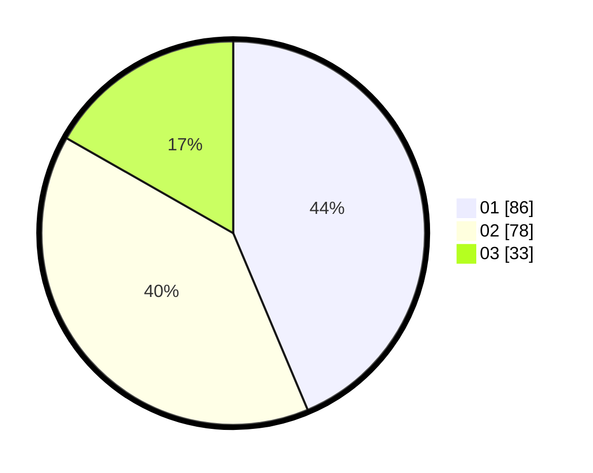

# Hasil

Hasil perolehan suara paslon dapat dilihat pada file paslon-01.txt, paslon-02.txt, dan paslon-03.txt.

Jika tidak ada, artinya data tersebut belum ada pada SIREKAP.

## Perolehan Suara

 * Paslon 01: **86**.
 * Paslon 02: **78**.
 * Paslon 03: **33**.

## Foto C Plano

https://sirekap-obj-formc.kpu.go.id/e714/pemilu/ppwp/31/73/06/10/02/3173061002150-20240216-025339--319921b2-e46e-48de-b5a5-8a6c5e6df76d.jpg

https://sirekap-obj-formc.kpu.go.id/e714/pemilu/ppwp/31/73/06/10/02/3173061002150-20240216-025343--dd02df30-187f-480d-a9d8-16c9caec16a0.jpg

https://sirekap-obj-formc.kpu.go.id/e714/pemilu/ppwp/31/73/06/10/02/3173061002150-20240216-025342--d6b4f08e-100f-450f-afe1-bfc6a9739e43.jpg

## DATA PEMILIH TETAP

Jumlah pemilih dalam DPT: **272**.
 * L: **126**.
 * P: **146**.

## DATA PENGGUNA HAK PILIH

Jumlah pengguna hak pilih dalam DPT: **190**.
 * L: **86**.
 * P: **104**.

Jumlah pengguna hak pilih dalam DPTb: **0**.
 * L: **0**.
 * P: **0**.

Jumlah pengguna hak pilih dalam DPK: **7**.
 * L: **3**.
 * P: **4**.

Jumlah pengguna hak pilih: **197**.
 * L: **0**.
 * P: **0**.

## JUMLAH SUARA SAH DAN TIDAK SAH

JUMLAH SELURUH SUARA SAH: **197**.

JUMLAH SUARA TIDAK SAH: **0**.

JUMLAH SELURUH SUARA SAH DAN SUARA TIDAK SAH: **197**.
