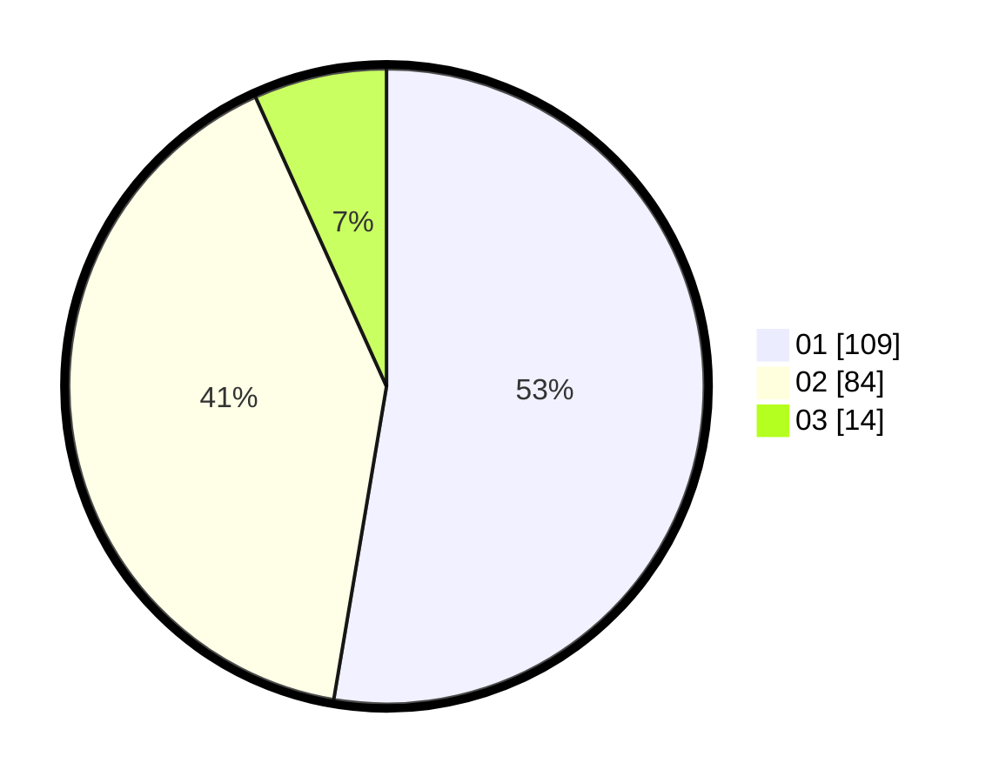

# Hasil

Hasil perolehan suara paslon dapat dilihat pada file paslon-01.txt, paslon-02.txt, dan paslon-03.txt.

Jika tidak ada, artinya data tersebut belum ada pada SIREKAP.

## Perolehan Suara

 * Paslon 01: **109**.
 * Paslon 02: **84**.
 * Paslon 03: **14**.

## Foto C Plano

https://sirekap-obj-formc.kpu.go.id/3a55/pemilu/ppwp/31/73/06/10/02/3173061002152-20240214-205707--a22b0c08-5f9d-4e4e-bd5c-017823f9a1b9.jpg

https://sirekap-obj-formc.kpu.go.id/3a55/pemilu/ppwp/31/73/06/10/02/3173061002152-20240214-211743--d3a4f862-9e14-4376-aa86-d48fb909405d.jpg

https://sirekap-obj-formc.kpu.go.id/3a55/pemilu/ppwp/31/73/06/10/02/3173061002152-20240214-211822--23bad2f3-5f1e-4cdb-8fc3-b0970815878d.jpg
