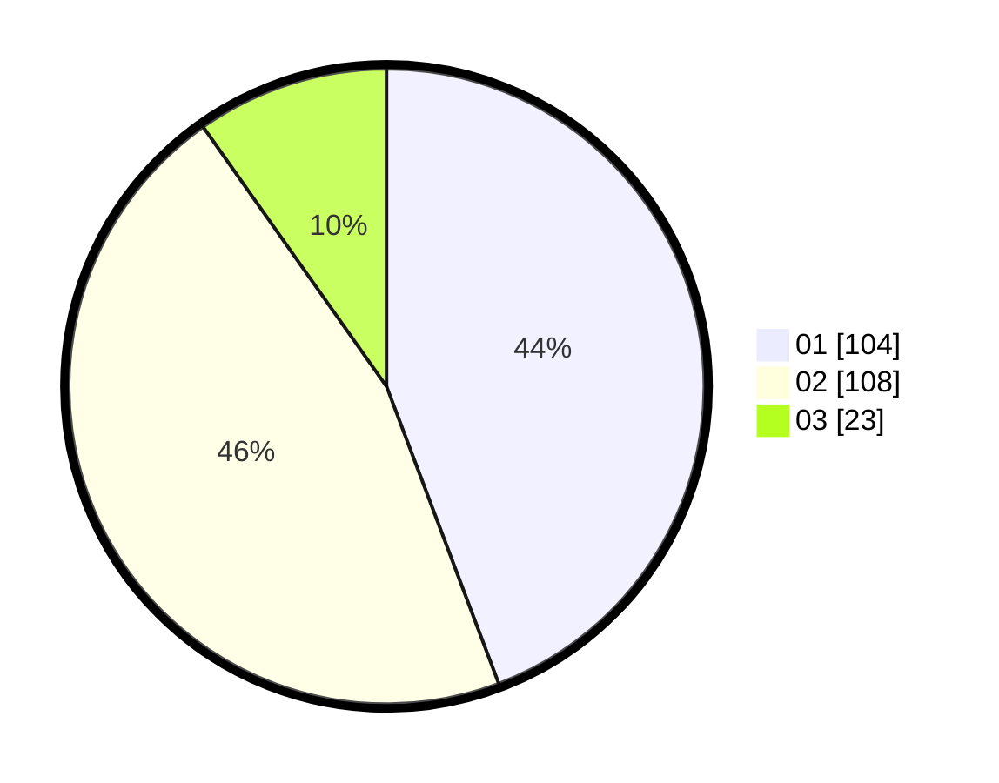

# Hasil

Hasil perolehan suara paslon dapat dilihat pada file paslon-01.txt, paslon-02.txt, dan paslon-03.txt.

Jika tidak ada, artinya data tersebut belum ada pada SIREKAP.

## Perolehan Suara

 * Paslon 01: **104**.
 * Paslon 02: **108**.
 * Paslon 03: **23**.

## Foto C Plano

https://sirekap-obj-formc.kpu.go.id/57d3/pemilu/ppwp/31/73/06/10/02/3173061002153-20240216-033700--4d36e373-723a-4f28-bc28-6b4cc65dc06b.jpg

https://sirekap-obj-formc.kpu.go.id/57d3/pemilu/ppwp/31/73/06/10/02/3173061002153-20240214-201533--9541c68a-5ba3-4e45-9bc3-b673847b5791.jpg

https://sirekap-obj-formc.kpu.go.id/57d3/pemilu/ppwp/31/73/06/10/02/3173061002153-20240214-195502--e4f68100-a911-4d3f-8c5f-9178ed01a403.jpg

## DATA PEMILIH TETAP

Jumlah pemilih dalam DPT: **286**.
 * L: **159**.
 * P: **127**.

## DATA PENGGUNA HAK PILIH

Jumlah pengguna hak pilih dalam DPT: **238**.
 * L: **130**.
 * P: **108**.

Jumlah pengguna hak pilih dalam DPTb: **2**.
 * L: **1**.
 * P: **1**.

Jumlah pengguna hak pilih dalam DPK: **2**.
 * L: **1**.
 * P: **1**.

Jumlah pengguna hak pilih: **242**.
 * L: **132**.
 * P: **110**.

## JUMLAH SUARA SAH DAN TIDAK SAH

JUMLAH SELURUH SUARA SAH: **235**.

JUMLAH SUARA TIDAK SAH: **7**.

JUMLAH SELURUH SUARA SAH DAN SUARA TIDAK SAH: **242**.
