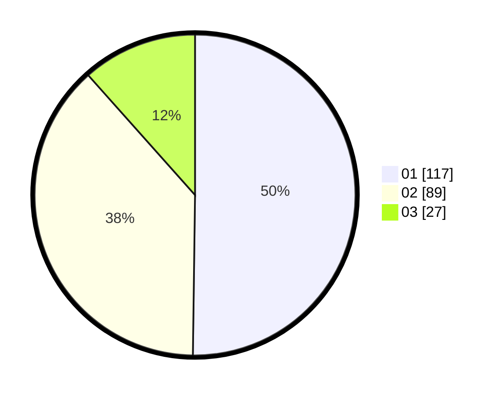

# Hasil

Hasil perolehan suara paslon dapat dilihat pada file paslon-01.txt, paslon-02.txt, dan paslon-03.txt.

Jika tidak ada, artinya data tersebut belum ada pada SIREKAP.

## Perolehan Suara

 * Paslon 01: **117**.
 * Paslon 02: **89**.
 * Paslon 03: **27**.

## Foto C Plano

https://sirekap-obj-formc.kpu.go.id/bd3f/pemilu/ppwp/31/73/06/10/02/3173061002160-20240214-224015--08ca26ff-7c92-4473-9e17-ddf77fe6bb37.jpg

https://sirekap-obj-formc.kpu.go.id/bd3f/pemilu/ppwp/31/73/06/10/02/3173061002160-20240214-224013--ae2901df-000d-4e1d-9593-058ff15be3b9.jpg

https://sirekap-obj-formc.kpu.go.id/bd3f/pemilu/ppwp/31/73/06/10/02/3173061002160-20240214-224010--27312f5b-831a-40af-92d8-60853a89fe3e.jpg
