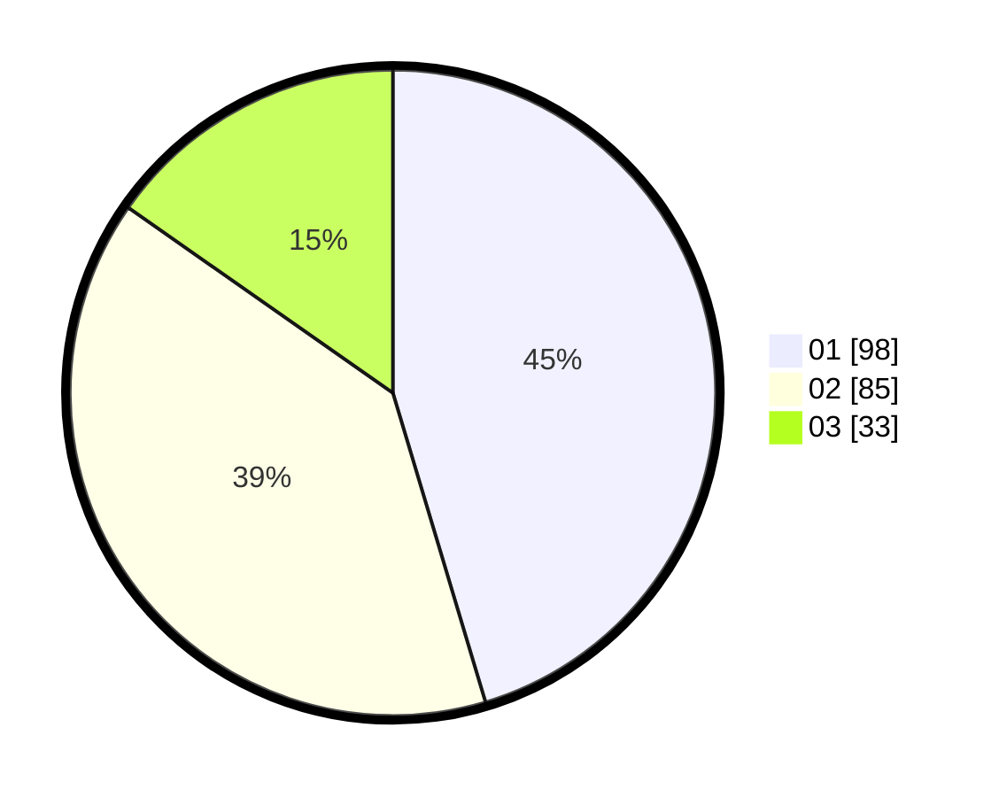

# Hasil

Hasil perolehan suara paslon dapat dilihat pada file paslon-01.txt, paslon-02.txt, dan paslon-03.txt.

Jika tidak ada, artinya data tersebut belum ada pada SIREKAP.

## Perolehan Suara

 * Paslon 01: **98**.
 * Paslon 02: **85**.
 * Paslon 03: **33**.

## Foto C Plano

https://sirekap-obj-formc.kpu.go.id/9c01/pemilu/ppwp/31/73/06/10/02/3173061002161-20240214-205900--4b26793f-b047-4ac7-8e0b-9817f0247eca.jpg

https://sirekap-obj-formc.kpu.go.id/9c01/pemilu/ppwp/31/73/06/10/02/3173061002161-20240214-230422--cd05a748-5b45-4af2-a723-859767f2e8d5.jpg

https://sirekap-obj-formc.kpu.go.id/9c01/pemilu/ppwp/31/73/06/10/02/3173061002161-20240214-211350--87da117c-1195-4c39-bc80-0f69c17ae923.jpg

## DATA PEMILIH TETAP

Jumlah pemilih dalam DPT: **254**.
 * L: **111**.
 * P: **103**.

## DATA PENGGUNA HAK PILIH

Jumlah pengguna hak pilih dalam DPT: **213**.
 * L: **111**.
 * P: **102**.

Jumlah pengguna hak pilih dalam DPTb: **0**.
 * L: **0**.
 * P: **0**.

Jumlah pengguna hak pilih dalam DPK: **1**.
 * L: **0**.
 * P: **1**.

Jumlah pengguna hak pilih: **214**.
 * L: **0**.
 * P: **70**.

## JUMLAH SUARA SAH DAN TIDAK SAH

JUMLAH SELURUH SUARA SAH: **216**.

JUMLAH SUARA TIDAK SAH: **1**.

JUMLAH SELURUH SUARA SAH DAN SUARA TIDAK SAH: **217**.
