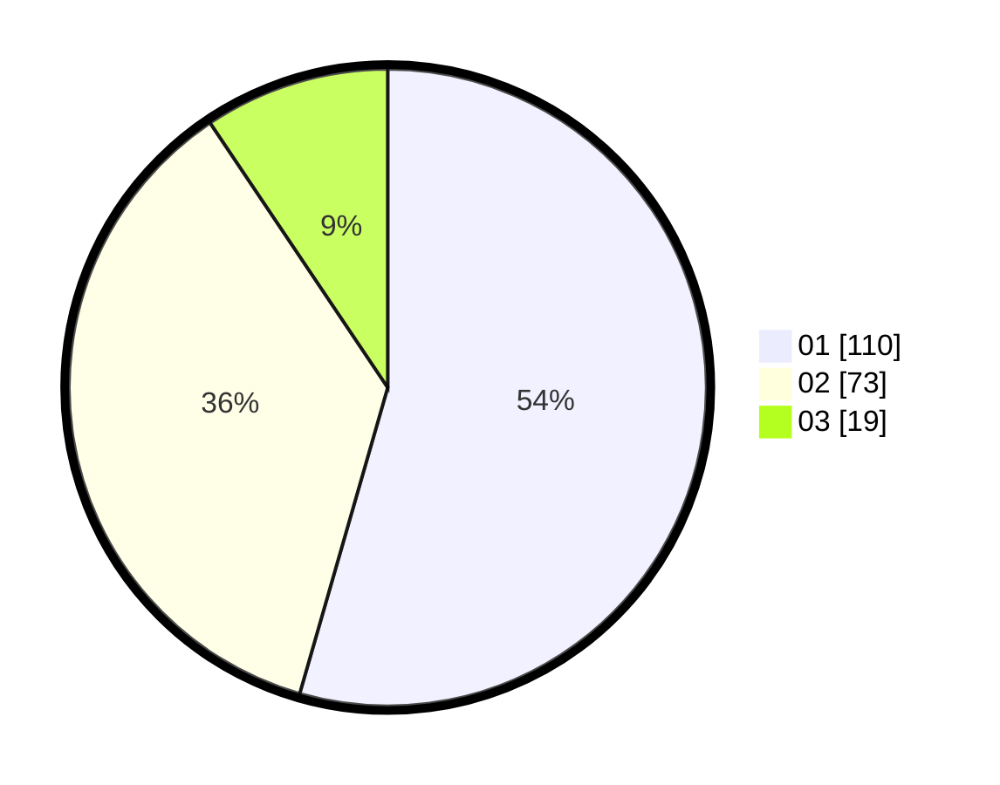

# Hasil

Hasil perolehan suara paslon dapat dilihat pada file paslon-01.txt, paslon-02.txt, dan paslon-03.txt.

Jika tidak ada, artinya data tersebut belum ada pada SIREKAP.

## Perolehan Suara

 * Paslon 01: **110**.
 * Paslon 02: **73**.
 * Paslon 03: **19**.

## Foto C Plano

https://sirekap-obj-formc.kpu.go.id/4f7f/pemilu/ppwp/31/73/06/10/02/3173061002164-20240214-221201--a8005b0d-279b-4431-8ffb-8b52ac152b50.jpg

https://sirekap-obj-formc.kpu.go.id/4f7f/pemilu/ppwp/31/73/06/10/02/3173061002164-20240214-221241--6cc8ff27-fcd6-4b28-b16b-fadbddb4c4e9.jpg

https://sirekap-obj-formc.kpu.go.id/4f7f/pemilu/ppwp/31/73/06/10/02/3173061002164-20240214-221315--2007ab00-5053-4cf9-a18a-a194879ceba5.jpg
