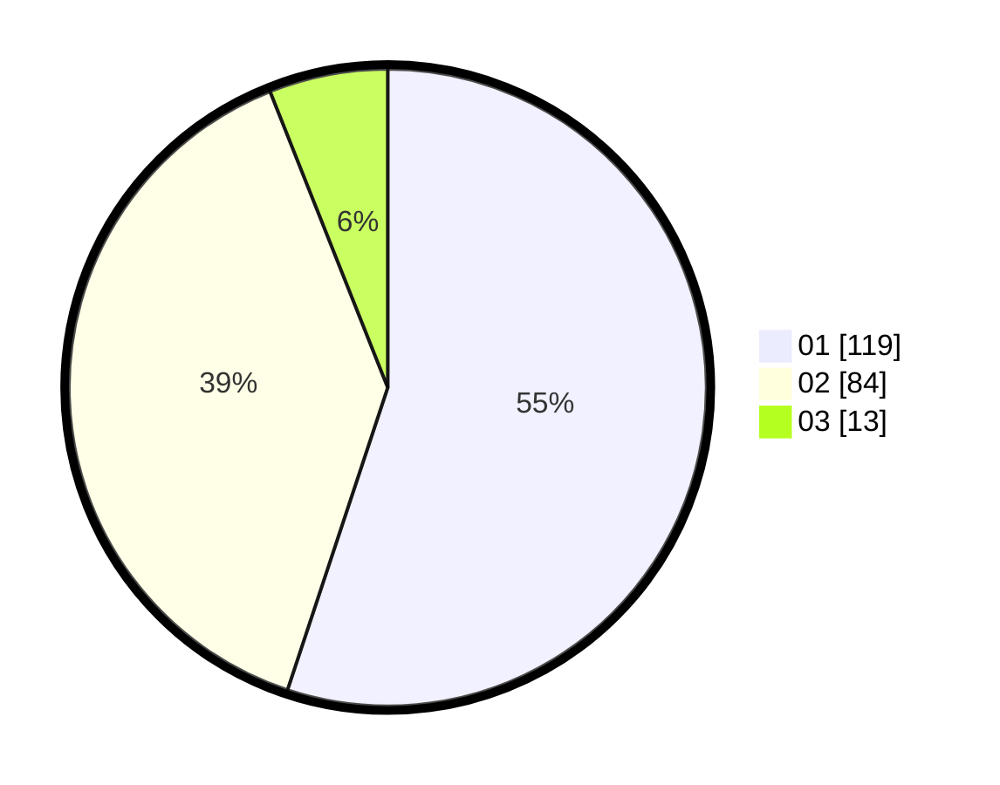

# Hasil

Hasil perolehan suara paslon dapat dilihat pada file paslon-01.txt, paslon-02.txt, dan paslon-03.txt.

Jika tidak ada, artinya data tersebut belum ada pada SIREKAP.

## Perolehan Suara

 * Paslon 01: **119**.
 * Paslon 02: **84**.
 * Paslon 03: **13**.

## Foto C Plano

https://sirekap-obj-formc.kpu.go.id/d8b2/pemilu/ppwp/31/73/06/10/02/3173061002167-20240214-234837--4f71357e-7d25-4faf-853e-a4b28212dca0.jpg

https://sirekap-obj-formc.kpu.go.id/d8b2/pemilu/ppwp/31/73/06/10/02/3173061002167-20240214-235101--79f24911-4800-4083-b879-99a87c46e7d6.jpg

https://sirekap-obj-formc.kpu.go.id/d8b2/pemilu/ppwp/31/73/06/10/02/3173061002167-20240214-235329--b54bc421-3df3-4c77-ade5-097cf02625c0.jpg
