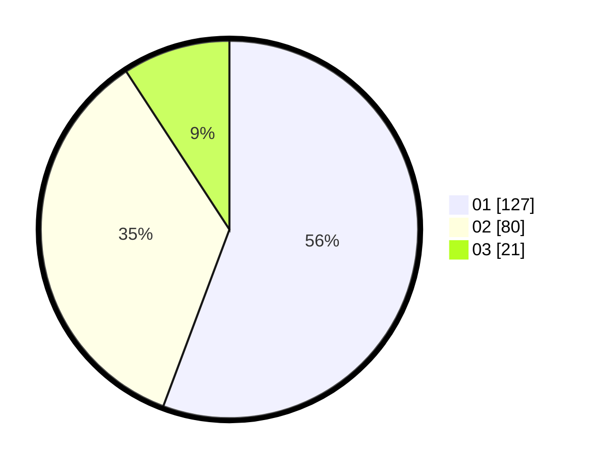

# Hasil

Hasil perolehan suara paslon dapat dilihat pada file paslon-01.txt, paslon-02.txt, dan paslon-03.txt.

Jika tidak ada, artinya data tersebut belum ada pada SIREKAP.

## Perolehan Suara

 * Paslon 01: **127**.
 * Paslon 02: **80**.
 * Paslon 03: **21**.

## Foto C Plano

https://sirekap-obj-formc.kpu.go.id/621a/pemilu/ppwp/31/73/06/10/02/3173061002170-20240214-225400--bbf94e91-fe5c-4277-a723-3bc65d2c035a.jpg

https://sirekap-obj-formc.kpu.go.id/621a/pemilu/ppwp/31/73/06/10/02/3173061002170-20240214-235509--5e65822b-7509-461b-9e75-8f4cb31b45a4.jpg

https://sirekap-obj-formc.kpu.go.id/621a/pemilu/ppwp/31/73/06/10/02/3173061002170-20240215-000040--5c12811e-ae30-443c-83c3-a843f6e1d7bc.jpg
