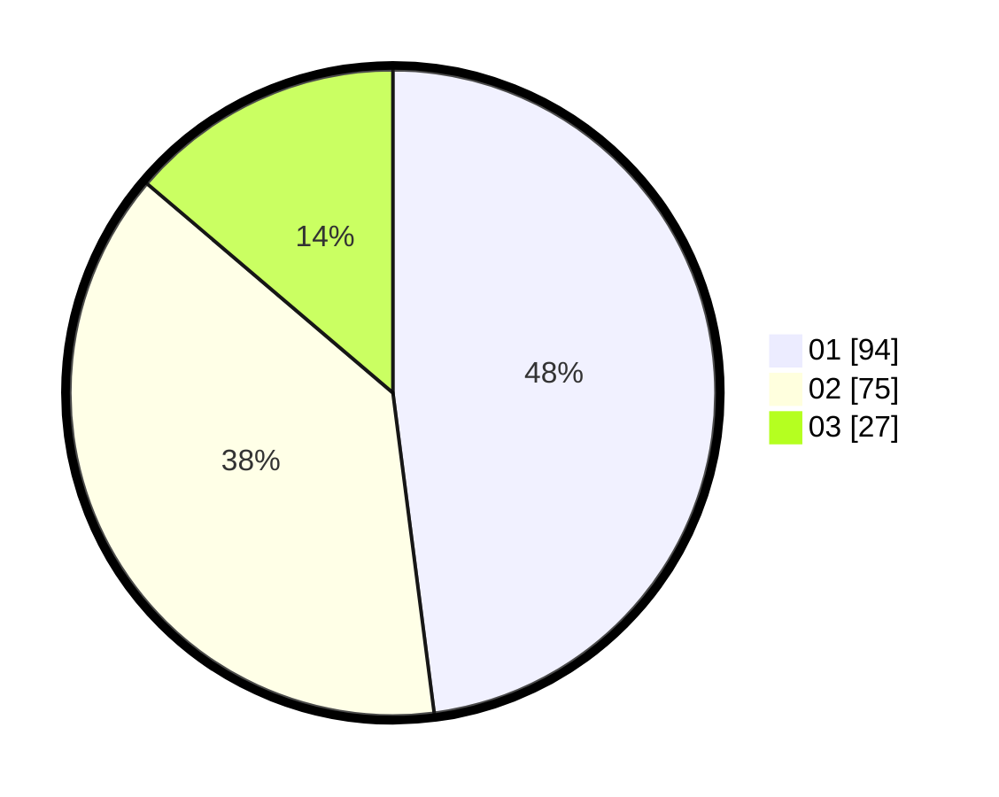

# Hasil

Hasil perolehan suara paslon dapat dilihat pada file paslon-01.txt, paslon-02.txt, dan paslon-03.txt.

Jika tidak ada, artinya data tersebut belum ada pada SIREKAP.

## Perolehan Suara

 * Paslon 01: **94**.
 * Paslon 02: **75**.
 * Paslon 03: **27**.

## Foto C Plano

https://sirekap-obj-formc.kpu.go.id/5b7d/pemilu/ppwp/31/73/06/10/02/3173061002172-20240214-223159--ce6095ce-45c5-4b78-83bb-886be93242c2.jpg

https://sirekap-obj-formc.kpu.go.id/5b7d/pemilu/ppwp/31/73/06/10/02/3173061002172-20240214-223330--dcafc5f4-2632-4b7e-aee1-9fa8b4d99afc.jpg

https://sirekap-obj-formc.kpu.go.id/5b7d/pemilu/ppwp/31/73/06/10/02/3173061002172-20240214-223513--6df2c0a7-f5a8-45c4-bd69-cdffc430b78f.jpg
