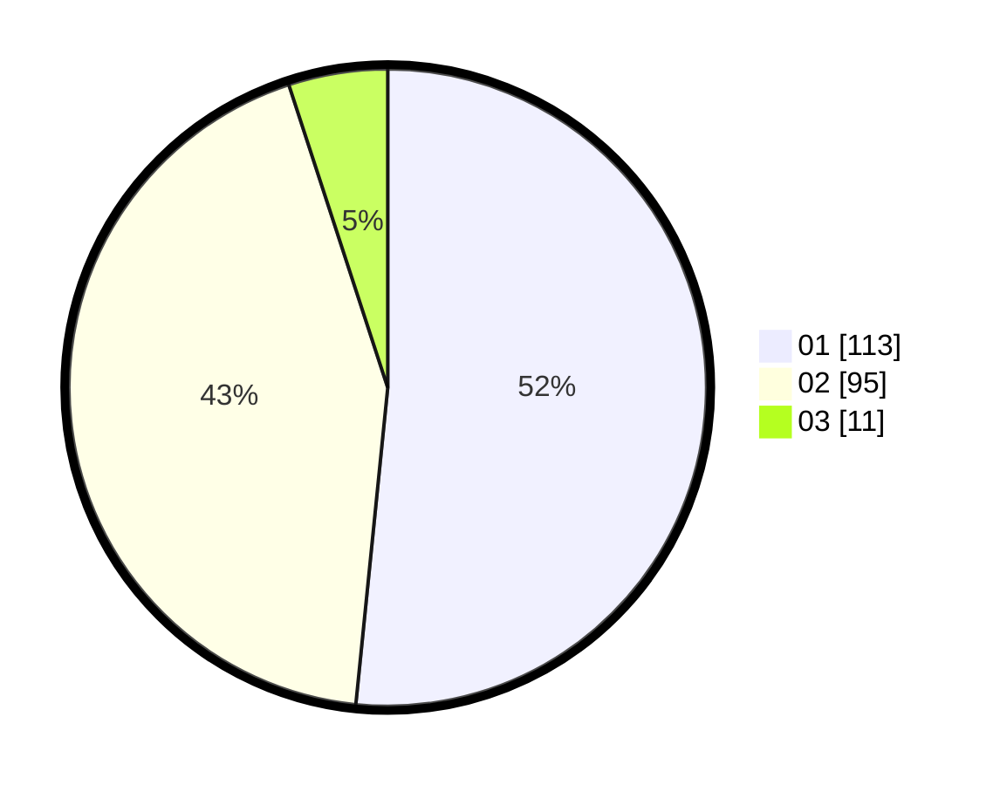

# Hasil

Hasil perolehan suara paslon dapat dilihat pada file paslon-01.txt, paslon-02.txt, dan paslon-03.txt.

Jika tidak ada, artinya data tersebut belum ada pada SIREKAP.

## Perolehan Suara

 * Paslon 01: **113**.
 * Paslon 02: **95**.
 * Paslon 03: **11**.

## Foto C Plano

https://sirekap-obj-formc.kpu.go.id/072c/pemilu/ppwp/31/73/06/10/02/3173061002179-20240215-005622--a795ad62-7797-4242-9358-7523d2a6f9e0.jpg

https://sirekap-obj-formc.kpu.go.id/072c/pemilu/ppwp/31/73/06/10/02/3173061002179-20240215-005643--dce4424b-4748-433d-8db2-717bfbfaebc7.jpg

https://sirekap-obj-formc.kpu.go.id/072c/pemilu/ppwp/31/73/06/10/02/3173061002179-20240215-005633--56160688-0aa8-4439-9e5c-8063e6aeaf6c.jpg

## DATA PEMILIH TETAP

Jumlah pemilih dalam DPT: **264**.
 * L: **136**.
 * P: **128**.

## DATA PENGGUNA HAK PILIH

Jumlah pengguna hak pilih dalam DPT: **219**.
 * L: **107**.
 * P: **112**.

Jumlah pengguna hak pilih dalam DPTb: **0**.
 * L: **0**.
 * P: **0**.

Jumlah pengguna hak pilih dalam DPK: **2**.
 * L: **1**.
 * P: **1**.

Jumlah pengguna hak pilih: **221**.
 * L: **108**.
 * P: **113**.

## JUMLAH SUARA SAH DAN TIDAK SAH

JUMLAH SELURUH SUARA SAH: **219**.

JUMLAH SUARA TIDAK SAH: **2**.

JUMLAH SELURUH SUARA SAH DAN SUARA TIDAK SAH: **221**.
