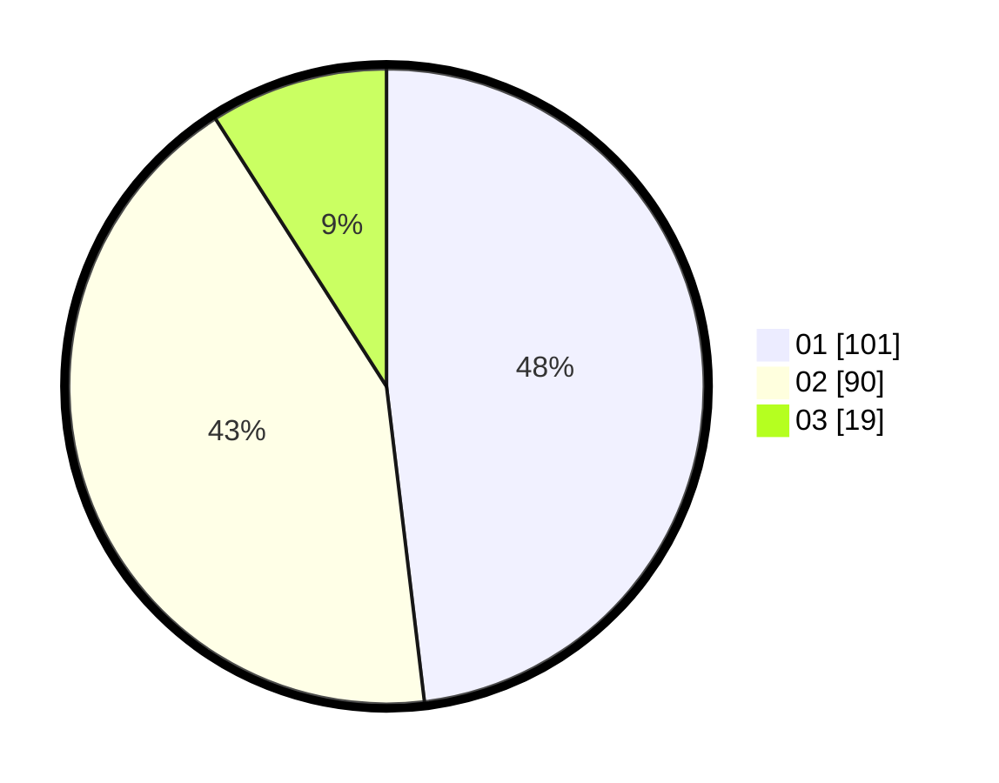

# Hasil

Hasil perolehan suara paslon dapat dilihat pada file paslon-01.txt, paslon-02.txt, dan paslon-03.txt.

Jika tidak ada, artinya data tersebut belum ada pada SIREKAP.

## Perolehan Suara

 * Paslon 01: **101**.
 * Paslon 02: **90**.
 * Paslon 03: **19**.

## Foto C Plano

https://sirekap-obj-formc.kpu.go.id/691b/pemilu/ppwp/31/73/06/10/02/3173061002180-20240216-141310--9fe4cc5b-220f-4857-8b00-483aa81e408c.jpg

https://sirekap-obj-formc.kpu.go.id/691b/pemilu/ppwp/31/73/06/10/02/3173061002180-20240214-194759--259a07bb-ddce-4200-a400-d7ab17783310.jpg

https://sirekap-obj-formc.kpu.go.id/691b/pemilu/ppwp/31/73/06/10/02/3173061002180-20240216-141311--18ea7b70-75b0-4f53-872c-31d212436e62.jpg

## DATA PEMILIH TETAP

Jumlah pemilih dalam DPT: **269**.
 * L: **137**.
 * P: **132**.

## DATA PENGGUNA HAK PILIH

Jumlah pengguna hak pilih dalam DPT: **210**.
 * L: **100**.
 * P: **110**.

Jumlah pengguna hak pilih dalam DPTb: **0**.
 * L: **0**.
 * P: **0**.

Jumlah pengguna hak pilih dalam DPK: **4**.
 * L: **2**.
 * P: **2**.

Jumlah pengguna hak pilih: **214**.
 * L: **102**.
 * P: **112**.

## JUMLAH SUARA SAH DAN TIDAK SAH

JUMLAH SELURUH SUARA SAH: **210**.

JUMLAH SUARA TIDAK SAH: **4**.

JUMLAH SELURUH SUARA SAH DAN SUARA TIDAK SAH: **214**.
