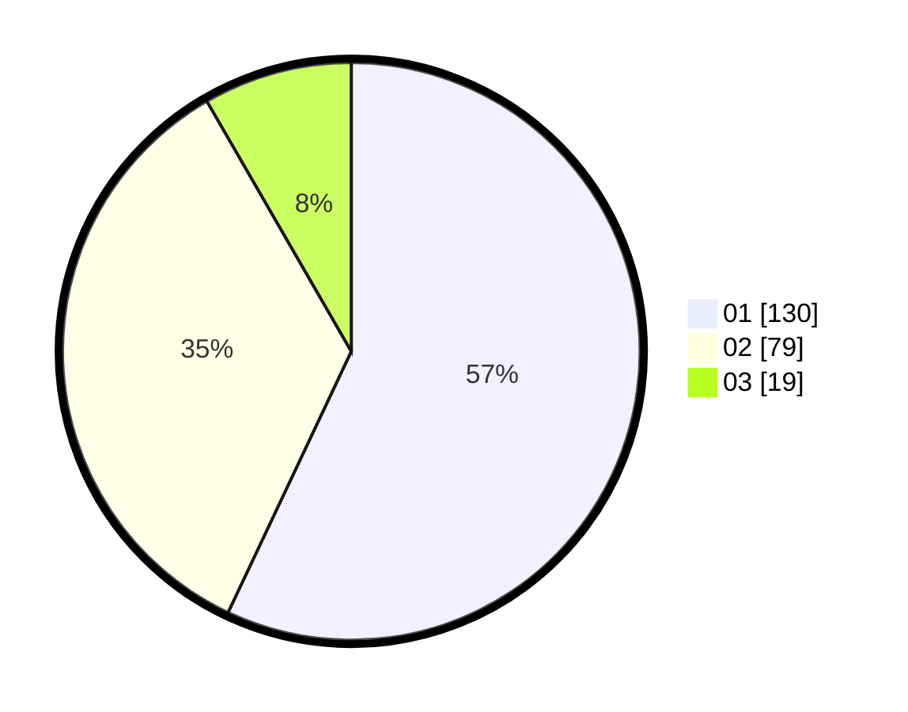

# Hasil

Hasil perolehan suara paslon dapat dilihat pada file paslon-01.txt, paslon-02.txt, dan paslon-03.txt.

Jika tidak ada, artinya data tersebut belum ada pada SIREKAP.

## Perolehan Suara

 * Paslon 01: **130**.
 * Paslon 02: **79**.
 * Paslon 03: **19**.

## Foto C Plano

https://sirekap-obj-formc.kpu.go.id/200a/pemilu/ppwp/31/73/06/10/02/3173061002181-20240216-153409--95d517cf-e464-455b-afef-de9d10735825.jpg

https://sirekap-obj-formc.kpu.go.id/200a/pemilu/ppwp/31/73/06/10/02/3173061002181-20240216-153257--40c840af-aa1b-4577-91ab-bbb7deb41968.jpg
