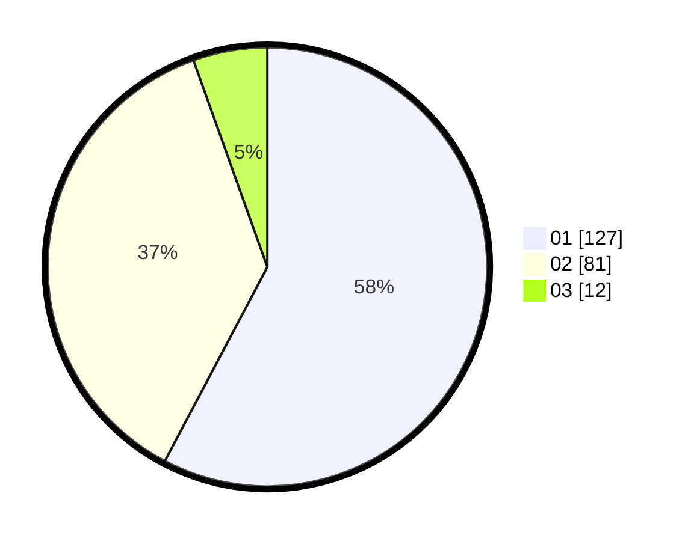

# Hasil

Hasil perolehan suara paslon dapat dilihat pada file paslon-01.txt, paslon-02.txt, dan paslon-03.txt.

Jika tidak ada, artinya data tersebut belum ada pada SIREKAP.

## Perolehan Suara

 * Paslon 01: **127**.
 * Paslon 02: **81**.
 * Paslon 03: **12**.

## Foto C Plano

https://sirekap-obj-formc.kpu.go.id/a226/pemilu/ppwp/31/73/06/10/02/3173061002182-20240214-220212--9ae6c3b2-94d9-4ccf-81b9-fa1f1b8a5990.jpg

https://sirekap-obj-formc.kpu.go.id/a226/pemilu/ppwp/31/73/06/10/02/3173061002182-20240214-220514--b87bffad-9724-4ee8-93b1-8b00d5cbbede.jpg

https://sirekap-obj-formc.kpu.go.id/a226/pemilu/ppwp/31/73/06/10/02/3173061002182-20240214-220924--1a240a47-e2f5-426c-b418-4bd6a0bddf24.jpg
