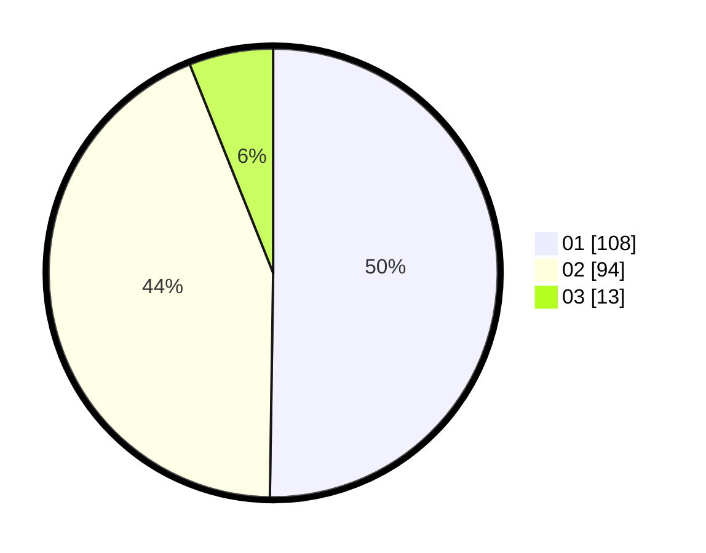

# Hasil

Hasil perolehan suara paslon dapat dilihat pada file paslon-01.txt, paslon-02.txt, dan paslon-03.txt.

Jika tidak ada, artinya data tersebut belum ada pada SIREKAP.

## Perolehan Suara

 * Paslon 01: **108**.
 * Paslon 02: **94**.
 * Paslon 03: **13**.

## Foto C Plano

https://sirekap-obj-formc.kpu.go.id/e666/pemilu/ppwp/31/73/06/10/02/3173061002184-20240215-003003--4d04a790-5332-401b-b40d-768c5bccaa16.jpg

https://sirekap-obj-formc.kpu.go.id/e666/pemilu/ppwp/31/73/06/10/02/3173061002184-20240215-003039--19360b1d-d273-4e49-9ea1-a4d4e1bd344a.jpg

https://sirekap-obj-formc.kpu.go.id/e666/pemilu/ppwp/31/73/06/10/02/3173061002184-20240215-003109--4fbfc320-bd32-405f-abb6-2a1d373925a4.jpg
