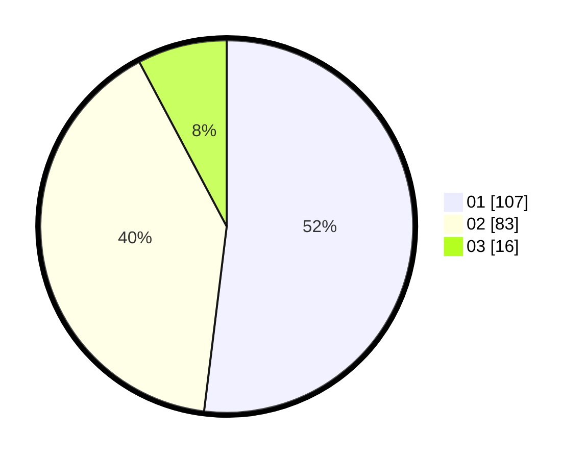

# Hasil

Hasil perolehan suara paslon dapat dilihat pada file paslon-01.txt, paslon-02.txt, dan paslon-03.txt.

Jika tidak ada, artinya data tersebut belum ada pada SIREKAP.

## Perolehan Suara

 * Paslon 01: **107**.
 * Paslon 02: **83**.
 * Paslon 03: **16**.

## Foto C Plano

https://sirekap-obj-formc.kpu.go.id/2550/pemilu/ppwp/31/73/06/10/02/3173061002185-20240214-220948--5a05b452-711c-44a4-9840-513d49896e0b.jpg

https://sirekap-obj-formc.kpu.go.id/2550/pemilu/ppwp/31/73/06/10/02/3173061002185-20240214-221117--3d6ffcd1-0a3f-462a-9a87-90f2787bcf6c.jpg

https://sirekap-obj-formc.kpu.go.id/2550/pemilu/ppwp/31/73/06/10/02/3173061002185-20240214-221213--d9f8f579-674b-426e-a286-aeb87065b07b.jpg

## DATA PEMILIH TETAP

Jumlah pemilih dalam DPT: **268**.
 * L: **148**.
 * P: **120**.

## DATA PENGGUNA HAK PILIH

Jumlah pengguna hak pilih dalam DPT: **205**.
 * L: **112**.
 * P: **93**.

Jumlah pengguna hak pilih dalam DPTb: **0**.
 * L: **0**.
 * P: **0**.

Jumlah pengguna hak pilih dalam DPK: **3**.
 * L: **1**.
 * P: **2**.

Jumlah pengguna hak pilih: **208**.
 * L: **113**.
 * P: **95**.

## JUMLAH SUARA SAH DAN TIDAK SAH

JUMLAH SELURUH SUARA SAH: **206**.

JUMLAH SUARA TIDAK SAH: **2**.

JUMLAH SELURUH SUARA SAH DAN SUARA TIDAK SAH: **208**.
