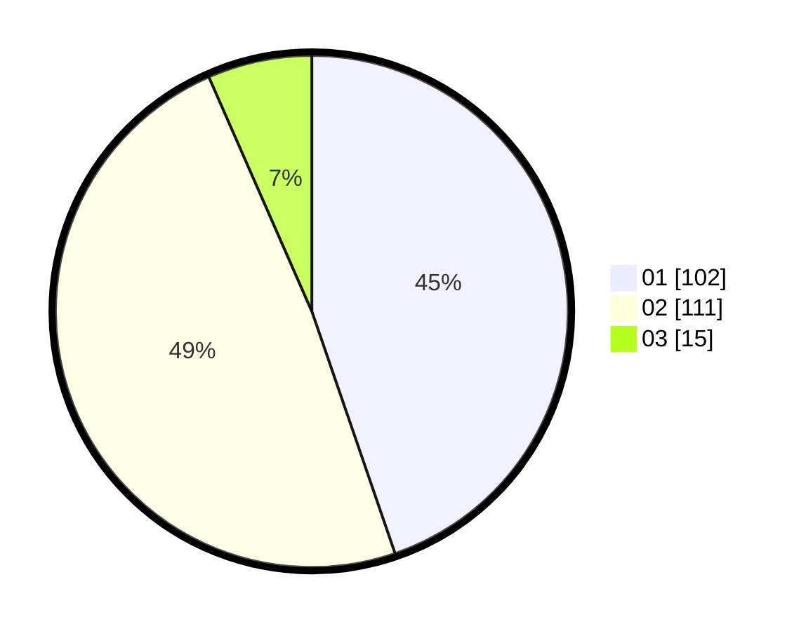

# Hasil

Hasil perolehan suara paslon dapat dilihat pada file paslon-01.txt, paslon-02.txt, dan paslon-03.txt.

Jika tidak ada, artinya data tersebut belum ada pada SIREKAP.

## Perolehan Suara

 * Paslon 01: **102**.
 * Paslon 02: **111**.
 * Paslon 03: **15**.

## Foto C Plano

https://sirekap-obj-formc.kpu.go.id/b925/pemilu/ppwp/31/73/06/10/02/3173061002186-20240214-213858--3282c262-88ee-4dd5-a873-db74a7e4d51a.jpg

https://sirekap-obj-formc.kpu.go.id/b925/pemilu/ppwp/31/73/06/10/02/3173061002186-20240214-213409--dcb15c31-ff31-4ca6-9f8b-e674cc7f8a8e.jpg

https://sirekap-obj-formc.kpu.go.id/b925/pemilu/ppwp/31/73/06/10/02/3173061002186-20240214-213732--c50e26f4-438d-452b-a60c-1897472717f3.jpg

## DATA PEMILIH TETAP

Jumlah pemilih dalam DPT: **285**.
 * L: **140**.
 * P: **145**.

## DATA PENGGUNA HAK PILIH

Jumlah pengguna hak pilih dalam DPT: **232**.
 * L: **110**.
 * P: **122**.

Jumlah pengguna hak pilih dalam DPTb: **0**.
 * L: **0**.
 * P: **0**.

Jumlah pengguna hak pilih dalam DPK: **0**.
 * L: **0**.
 * P: **0**.

Jumlah pengguna hak pilih: **232**.
 * L: **110**.
 * P: **122**.

## JUMLAH SUARA SAH DAN TIDAK SAH

JUMLAH SELURUH SUARA SAH: **228**.

JUMLAH SUARA TIDAK SAH: **4**.

JUMLAH SELURUH SUARA SAH DAN SUARA TIDAK SAH: **232**.
