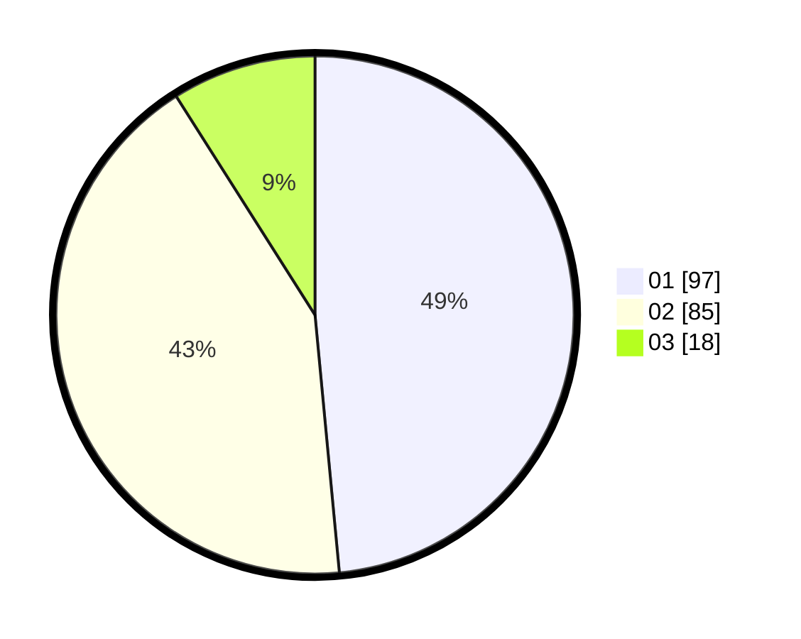

# Hasil

Hasil perolehan suara paslon dapat dilihat pada file paslon-01.txt, paslon-02.txt, dan paslon-03.txt.

Jika tidak ada, artinya data tersebut belum ada pada SIREKAP.

## Perolehan Suara

 * Paslon 01: **97**.
 * Paslon 02: **85**.
 * Paslon 03: **18**.

## Foto C Plano

https://sirekap-obj-formc.kpu.go.id/2591/pemilu/ppwp/31/73/06/10/02/3173061002187-20240214-214145--0f267291-d5d9-401c-adbc-1a75191f0930.jpg

https://sirekap-obj-formc.kpu.go.id/2591/pemilu/ppwp/31/73/06/10/02/3173061002187-20240214-214206--bb1905fc-1bd1-4058-92ad-61547d540bf6.jpg

https://sirekap-obj-formc.kpu.go.id/2591/pemilu/ppwp/31/73/06/10/02/3173061002187-20240214-214156--31a02b64-b33b-4471-ae73-892553e65de6.jpg

## DATA PEMILIH TETAP

Jumlah pemilih dalam DPT: **263**.
 * L: **129**.
 * P: **134**.

## DATA PENGGUNA HAK PILIH

Jumlah pengguna hak pilih dalam DPT: **204**.
 * L: **99**.
 * P: **105**.

Jumlah pengguna hak pilih dalam DPTb: **0**.
 * L: **0**.
 * P: **0**.

Jumlah pengguna hak pilih dalam DPK: **1**.
 * L: **1**.
 * P: **0**.

Jumlah pengguna hak pilih: **205**.
 * L: **100**.
 * P: **105**.

## JUMLAH SUARA SAH DAN TIDAK SAH

JUMLAH SELURUH SUARA SAH: **200**.

JUMLAH SUARA TIDAK SAH: **5**.

JUMLAH SELURUH SUARA SAH DAN SUARA TIDAK SAH: **205**.
