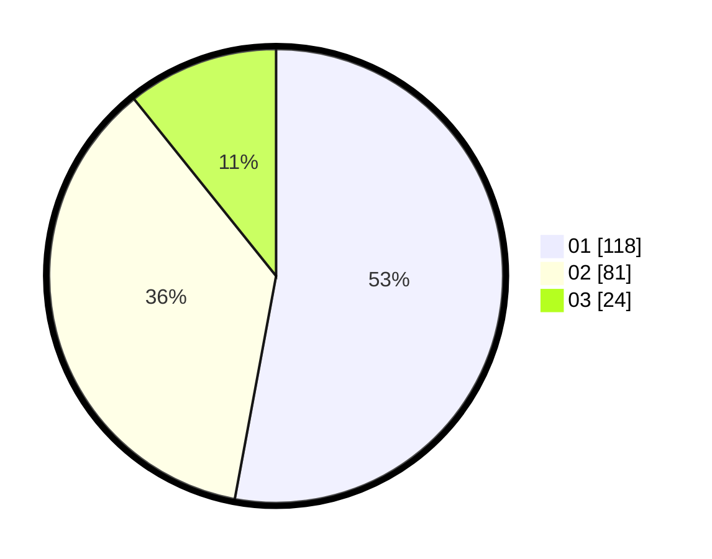

# Hasil

Hasil perolehan suara paslon dapat dilihat pada file paslon-01.txt, paslon-02.txt, dan paslon-03.txt.

Jika tidak ada, artinya data tersebut belum ada pada SIREKAP.

## Perolehan Suara

 * Paslon 01: **118**.
 * Paslon 02: **81**.
 * Paslon 03: **24**.

## Foto C Plano

https://sirekap-obj-formc.kpu.go.id/b00b/pemilu/ppwp/31/73/06/10/02/3173061002189-20240215-025744--9eef5cfb-07ac-44ca-b2ef-29d1b67e1a71.jpg

https://sirekap-obj-formc.kpu.go.id/b00b/pemilu/ppwp/31/73/06/10/02/3173061002189-20240215-025811--d3df6383-5d37-4e27-816d-2fa5dcb94b7e.jpg

https://sirekap-obj-formc.kpu.go.id/b00b/pemilu/ppwp/31/73/06/10/02/3173061002189-20240215-025913--259cb966-0adb-4bac-964b-02e836fcdd89.jpg

## DATA PEMILIH TETAP

Jumlah pemilih dalam DPT: **269**.
 * L: **131**.
 * P: **138**.

## DATA PENGGUNA HAK PILIH

Jumlah pengguna hak pilih dalam DPT: **228**.
 * L: **110**.
 * P: **118**.

Jumlah pengguna hak pilih dalam DPTb: **0**.
 * L: **0**.
 * P: **0**.

Jumlah pengguna hak pilih dalam DPK: **1**.
 * L: **0**.
 * P: **1**.

Jumlah pengguna hak pilih: **229**.
 * L: **110**.
 * P: **119**.

## JUMLAH SUARA SAH DAN TIDAK SAH

JUMLAH SELURUH SUARA SAH: **223**.

JUMLAH SUARA TIDAK SAH: **6**.

JUMLAH SELURUH SUARA SAH DAN SUARA TIDAK SAH: **229**.
