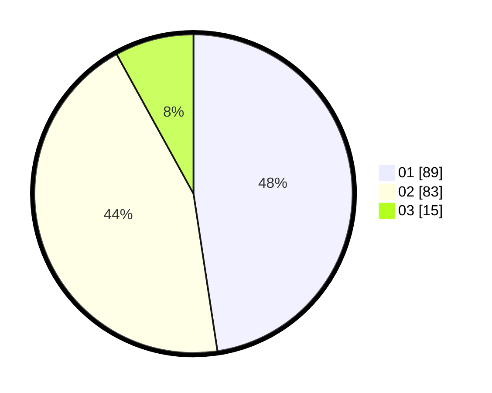

# Hasil

Hasil perolehan suara paslon dapat dilihat pada file paslon-01.txt, paslon-02.txt, dan paslon-03.txt.

Jika tidak ada, artinya data tersebut belum ada pada SIREKAP.

## Perolehan Suara

 * Paslon 01: **89**.
 * Paslon 02: **83**.
 * Paslon 03: **15**.

## Foto C Plano

https://sirekap-obj-formc.kpu.go.id/24b6/pemilu/ppwp/31/73/06/10/02/3173061002190-20240215-102153--128740d5-abb6-4d8d-826d-582e175d6664.jpg

https://sirekap-obj-formc.kpu.go.id/24b6/pemilu/ppwp/31/73/06/10/02/3173061002190-20240215-102539--5e1063f3-c920-48b5-b5c5-ed2968bbf7a1.jpg

https://sirekap-obj-formc.kpu.go.id/24b6/pemilu/ppwp/31/73/06/10/02/3173061002190-20240215-102856--221e5d0f-d59b-4c08-928e-69eab2078edb.jpg
