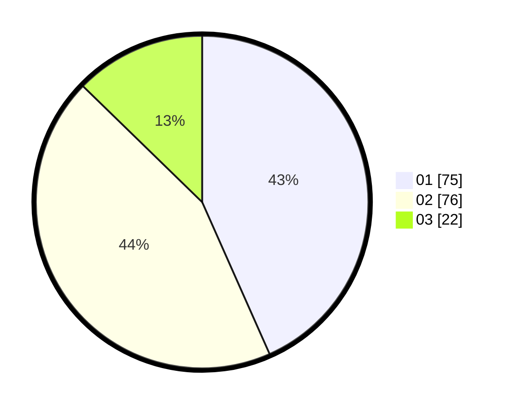

# Hasil

Hasil perolehan suara paslon dapat dilihat pada file paslon-01.txt, paslon-02.txt, dan paslon-03.txt.

Jika tidak ada, artinya data tersebut belum ada pada SIREKAP.

## Perolehan Suara

 * Paslon 01: **75**.
 * Paslon 02: **76**.
 * Paslon 03: **22**.

## Foto C Plano

https://sirekap-obj-formc.kpu.go.id/3627/pemilu/ppwp/31/73/06/10/02/3173061002193-20240214-212557--83a649d6-3aa2-46c6-a67a-61f33271581a.jpg

https://sirekap-obj-formc.kpu.go.id/3627/pemilu/ppwp/31/73/06/10/02/3173061002193-20240214-230325--b367ac16-b6e2-44a1-b850-abbb1274dd86.jpg

https://sirekap-obj-formc.kpu.go.id/3627/pemilu/ppwp/31/73/06/10/02/3173061002193-20240214-193341--7b585d0b-bdac-4a3b-a3fb-c4e14ccc7c4e.jpg

## DATA PEMILIH TETAP

Jumlah pemilih dalam DPT: **265**.
 * L: **130**.
 * P: **135**.

## DATA PENGGUNA HAK PILIH

Jumlah pengguna hak pilih dalam DPT: **173**.
 * L: **78**.
 * P: **95**.

Jumlah pengguna hak pilih dalam DPTb: **0**.
 * L: **0**.
 * P: **0**.

Jumlah pengguna hak pilih dalam DPK: **2**.
 * L: **2**.
 * P: **0**.

Jumlah pengguna hak pilih: **175**.
 * L: **80**.
 * P: **95**.

## JUMLAH SUARA SAH DAN TIDAK SAH

JUMLAH SELURUH SUARA SAH: **173**.

JUMLAH SUARA TIDAK SAH: **2**.

JUMLAH SELURUH SUARA SAH DAN SUARA TIDAK SAH: **175**.
