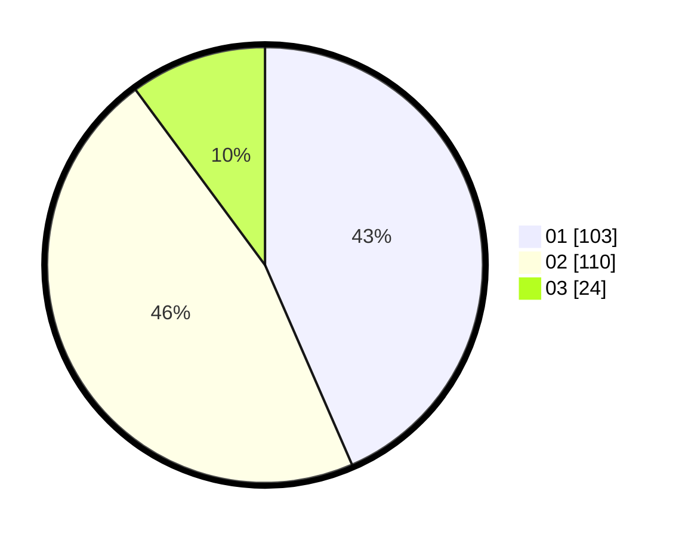

# Hasil

Hasil perolehan suara paslon dapat dilihat pada file paslon-01.txt, paslon-02.txt, dan paslon-03.txt.

Jika tidak ada, artinya data tersebut belum ada pada SIREKAP.

## Perolehan Suara

 * Paslon 01: **103**.
 * Paslon 02: **110**.
 * Paslon 03: **24**.

## Foto C Plano

https://sirekap-obj-formc.kpu.go.id/a758/pemilu/ppwp/31/73/06/10/02/3173061002194-20240214-222642--160fbfbd-82ad-4e47-8f88-a4eec556f61d.jpg

https://sirekap-obj-formc.kpu.go.id/a758/pemilu/ppwp/31/73/06/10/02/3173061002194-20240214-222719--037b5730-d579-4755-9b0a-75b5a445ef43.jpg

https://sirekap-obj-formc.kpu.go.id/a758/pemilu/ppwp/31/73/06/10/02/3173061002194-20240214-222748--9db461b3-5e2e-4223-abe9-f53a36ef6475.jpg
