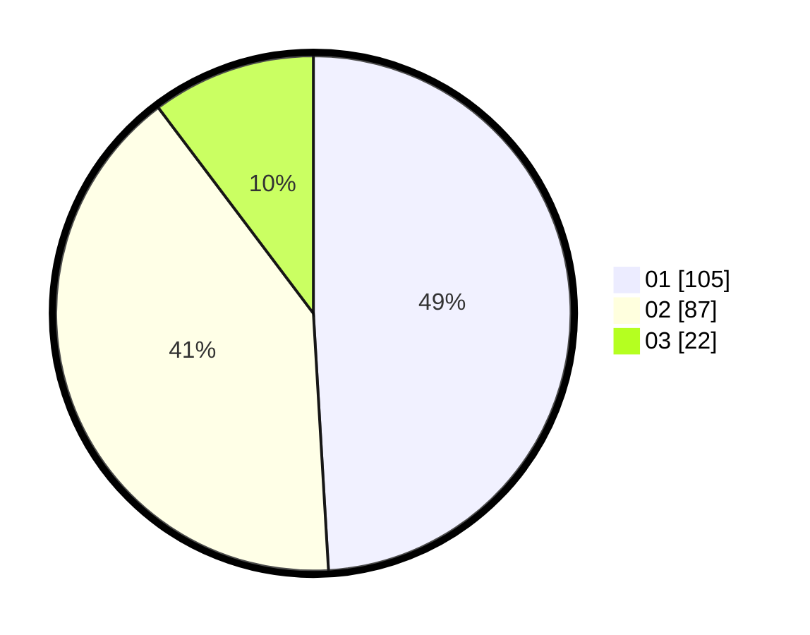

# Hasil

Hasil perolehan suara paslon dapat dilihat pada file paslon-01.txt, paslon-02.txt, dan paslon-03.txt.

Jika tidak ada, artinya data tersebut belum ada pada SIREKAP.

## Perolehan Suara

 * Paslon 01: **105**.
 * Paslon 02: **87**.
 * Paslon 03: **22**.

## Foto C Plano

https://sirekap-obj-formc.kpu.go.id/a84b/pemilu/ppwp/31/73/06/10/02/3173061002199-20240215-021643--2ac7a702-ca4c-4da0-9f81-d2d7fc3e3824.jpg

https://sirekap-obj-formc.kpu.go.id/a84b/pemilu/ppwp/31/73/06/10/02/3173061002199-20240215-021721--4f4c9ca8-752e-4e61-9500-614b0f43858f.jpg

https://sirekap-obj-formc.kpu.go.id/a84b/pemilu/ppwp/31/73/06/10/02/3173061002199-20240215-021557--c1b7653a-7be7-4ec0-a891-3dce03036335.jpg
