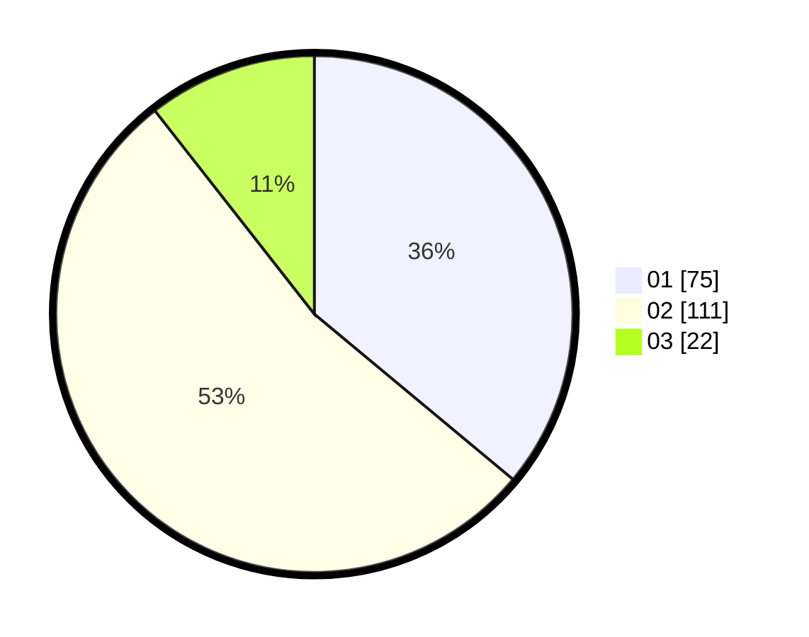

# Hasil

Hasil perolehan suara paslon dapat dilihat pada file paslon-01.txt, paslon-02.txt, dan paslon-03.txt.

Jika tidak ada, artinya data tersebut belum ada pada SIREKAP.

## Perolehan Suara

 * Paslon 01: **75**.
 * Paslon 02: **111**.
 * Paslon 03: **22**.

## Foto C Plano

https://sirekap-obj-formc.kpu.go.id/5708/pemilu/ppwp/31/73/06/10/02/3173061002200-20240214-221107--82e340a7-c4fb-4be3-8df7-617ea57ed1e6.jpg

https://sirekap-obj-formc.kpu.go.id/5708/pemilu/ppwp/31/73/06/10/02/3173061002200-20240214-221141--85745cdd-4523-427b-9aee-a355ca522b8b.jpg

https://sirekap-obj-formc.kpu.go.id/5708/pemilu/ppwp/31/73/06/10/02/3173061002200-20240214-221219--4190a2fd-4adb-439f-98cd-758018e668c6.jpg

## DATA PEMILIH TETAP

Jumlah pemilih dalam DPT: **268**.
 * L: **132**.
 * P: **136**.

## DATA PENGGUNA HAK PILIH

Jumlah pengguna hak pilih dalam DPT: **212**.
 * L: **114**.
 * P: **98**.

Jumlah pengguna hak pilih dalam DPTb: **0**.
 * L: **0**.
 * P: **0**.

Jumlah pengguna hak pilih dalam DPK: **0**.
 * L: **0**.
 * P: **0**.

Jumlah pengguna hak pilih: **212**.
 * L: **114**.
 * P: **98**.

## JUMLAH SUARA SAH DAN TIDAK SAH

JUMLAH SELURUH SUARA SAH: **209**.

JUMLAH SUARA TIDAK SAH: **3**.

JUMLAH SELURUH SUARA SAH DAN SUARA TIDAK SAH: **212**.
