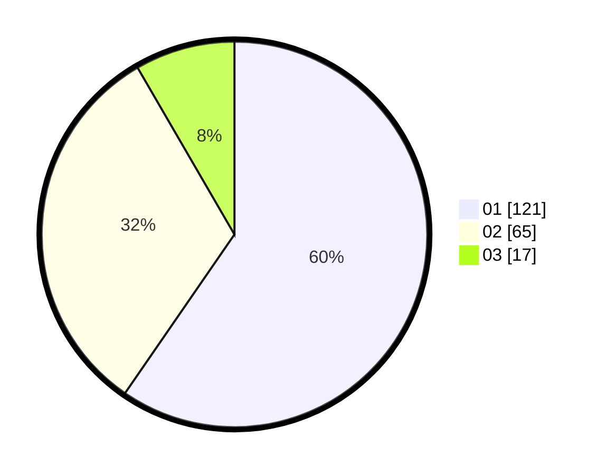

# Hasil

Hasil perolehan suara paslon dapat dilihat pada file paslon-01.txt, paslon-02.txt, dan paslon-03.txt.

Jika tidak ada, artinya data tersebut belum ada pada SIREKAP.

## Perolehan Suara

 * Paslon 01: **121**.
 * Paslon 02: **65**.
 * Paslon 03: **17**.

## Foto C Plano

https://sirekap-obj-formc.kpu.go.id/e0a6/pemilu/ppwp/31/73/06/10/02/3173061002202-20240214-211527--621de43c-7cc3-40be-9d64-ad8c8c98f52e.jpg

https://sirekap-obj-formc.kpu.go.id/e0a6/pemilu/ppwp/31/73/06/10/02/3173061002202-20240214-211555--f8ffd94a-9c6e-4bee-92f3-00a4f1787159.jpg
