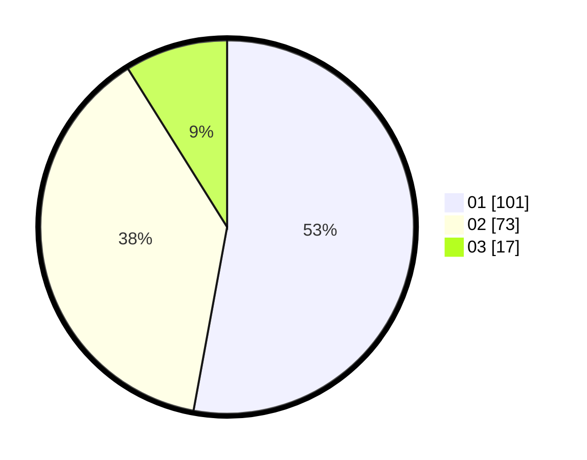

# Hasil

Hasil perolehan suara paslon dapat dilihat pada file paslon-01.txt, paslon-02.txt, dan paslon-03.txt.

Jika tidak ada, artinya data tersebut belum ada pada SIREKAP.

## Perolehan Suara

 * Paslon 01: **101**.
 * Paslon 02: **73**.
 * Paslon 03: **17**.

## Foto C Plano

https://sirekap-obj-formc.kpu.go.id/4a3b/pemilu/ppwp/31/73/06/10/02/3173061002203-20240214-233406--4772d509-591f-45d4-b3aa-549b94db25de.jpg

https://sirekap-obj-formc.kpu.go.id/4a3b/pemilu/ppwp/31/73/06/10/02/3173061002203-20240214-224237--6f26bfd5-1582-4bb0-a0c3-94ed891ab19d.jpg

https://sirekap-obj-formc.kpu.go.id/4a3b/pemilu/ppwp/31/73/06/10/02/3173061002203-20240214-224332--be944db5-920b-4c5d-9fdd-1b75406964e5.jpg
