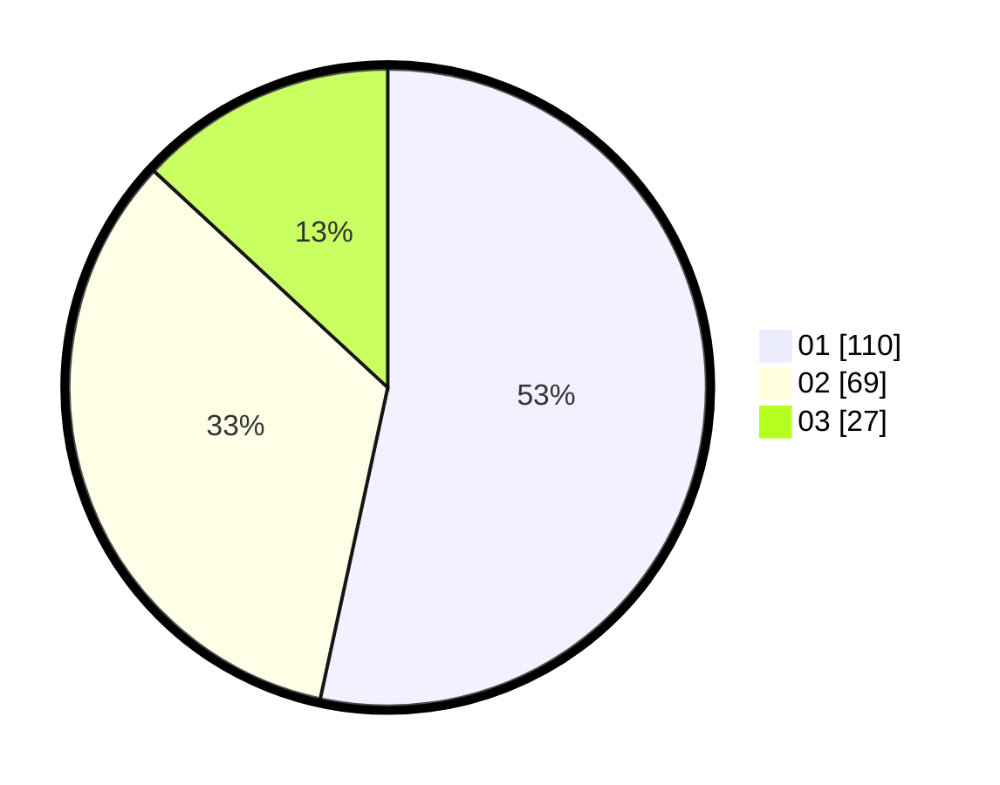

# Hasil

Hasil perolehan suara paslon dapat dilihat pada file paslon-01.txt, paslon-02.txt, dan paslon-03.txt.

Jika tidak ada, artinya data tersebut belum ada pada SIREKAP.

## Perolehan Suara

 * Paslon 01: **110**.
 * Paslon 02: **69**.
 * Paslon 03: **27**.

## Foto C Plano

https://sirekap-obj-formc.kpu.go.id/2164/pemilu/ppwp/31/73/06/10/02/3173061002208-20240214-155807--4cc8a5ed-2a94-4f8e-83ec-411176e459d0.jpg

https://sirekap-obj-formc.kpu.go.id/2164/pemilu/ppwp/31/73/06/10/02/3173061002208-20240214-155858--071260b4-3079-46f5-a906-ed85d1fc2d8b.jpg

https://sirekap-obj-formc.kpu.go.id/2164/pemilu/ppwp/31/73/06/10/02/3173061002208-20240214-160059--0477f531-e101-444f-b9d5-9c2bd577da7c.jpg
