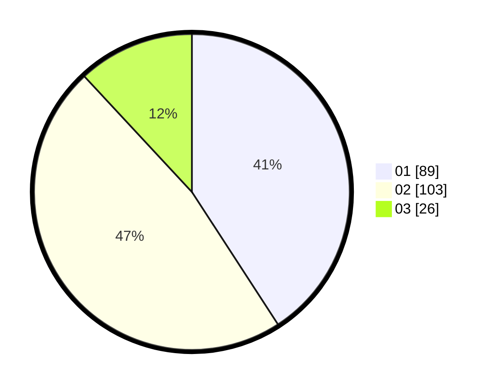

# Hasil

Hasil perolehan suara paslon dapat dilihat pada file paslon-01.txt, paslon-02.txt, dan paslon-03.txt.

Jika tidak ada, artinya data tersebut belum ada pada SIREKAP.

## Perolehan Suara

 * Paslon 01: **89**.
 * Paslon 02: **103**.
 * Paslon 03: **26**.

## Foto C Plano

https://sirekap-obj-formc.kpu.go.id/31db/pemilu/ppwp/31/73/06/10/02/3173061002209-20240215-210558--584aa6f3-7fd7-4c06-bab1-d7bcec812c79.jpg

https://sirekap-obj-formc.kpu.go.id/31db/pemilu/ppwp/31/73/06/10/02/3173061002209-20240215-210600--6de4feea-686b-4cd2-96b4-c9802e3e3c47.jpg

https://sirekap-obj-formc.kpu.go.id/31db/pemilu/ppwp/31/73/06/10/02/3173061002209-20240215-210559--a44817f5-71f6-49fb-9dc1-89f4d02072b5.jpg

## DATA PEMILIH TETAP

Jumlah pemilih dalam DPT: **265**.
 * L: **144**.
 * P: **121**.

## DATA PENGGUNA HAK PILIH

Jumlah pengguna hak pilih dalam DPT: **218**.
 * L: **115**.
 * P: **103**.

Jumlah pengguna hak pilih dalam DPTb: **0**.
 * L: **0**.
 * P: **0**.

Jumlah pengguna hak pilih dalam DPK: **4**.
 * L: **1**.
 * P: **3**.

Jumlah pengguna hak pilih: **222**.
 * L: **116**.
 * P: **106**.

## JUMLAH SUARA SAH DAN TIDAK SAH

JUMLAH SELURUH SUARA SAH: **218**.

JUMLAH SUARA TIDAK SAH: **4**.

JUMLAH SELURUH SUARA SAH DAN SUARA TIDAK SAH: **222**.
