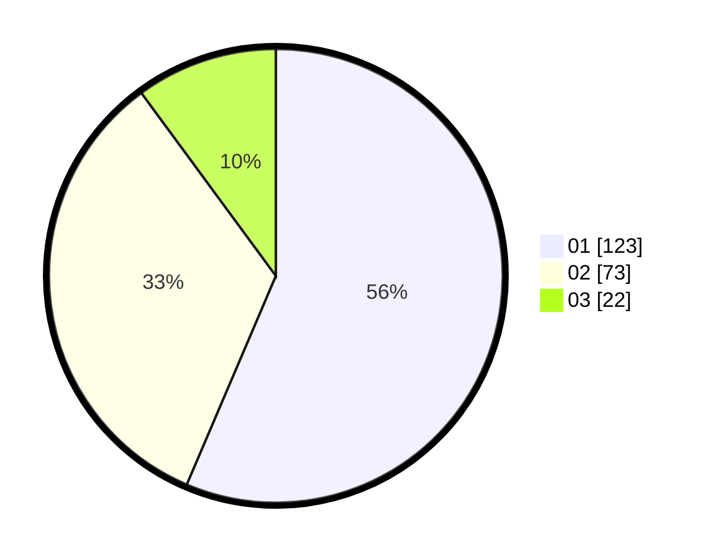

# Hasil

Hasil perolehan suara paslon dapat dilihat pada file paslon-01.txt, paslon-02.txt, dan paslon-03.txt.

Jika tidak ada, artinya data tersebut belum ada pada SIREKAP.

## Perolehan Suara

 * Paslon 01: **123**.
 * Paslon 02: **73**.
 * Paslon 03: **22**.

## Foto C Plano

https://sirekap-obj-formc.kpu.go.id/3e1e/pemilu/ppwp/31/73/06/10/02/3173061002214-20240214-224703--b5e44c95-29c0-41e6-8634-4cb27ae8a212.jpg

https://sirekap-obj-formc.kpu.go.id/3e1e/pemilu/ppwp/31/73/06/10/02/3173061002214-20240214-224820--55294ea6-54a0-44b2-b2d1-11201f959061.jpg

https://sirekap-obj-formc.kpu.go.id/3e1e/pemilu/ppwp/31/73/06/10/02/3173061002214-20240214-224925--b905fe5e-7b4c-4fe4-b769-7c1d6bc03d2a.jpg
