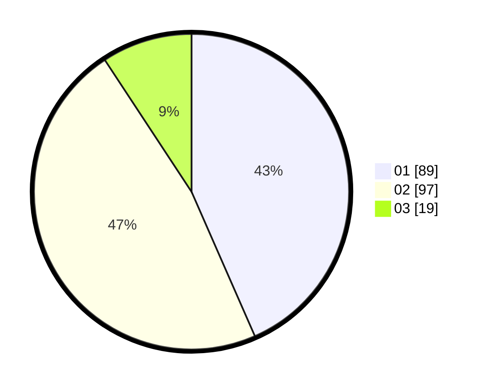

# Hasil

Hasil perolehan suara paslon dapat dilihat pada file paslon-01.txt, paslon-02.txt, dan paslon-03.txt.

Jika tidak ada, artinya data tersebut belum ada pada SIREKAP.

## Perolehan Suara

 * Paslon 01: **89**.
 * Paslon 02: **97**.
 * Paslon 03: **19**.

## Foto C Plano

https://sirekap-obj-formc.kpu.go.id/2ea1/pemilu/ppwp/31/73/06/10/02/3173061002215-20240214-184815--6f230afb-7e36-49b7-8b1f-0983ca81b8e6.jpg

https://sirekap-obj-formc.kpu.go.id/2ea1/pemilu/ppwp/31/73/06/10/02/3173061002215-20240214-184709--d79a8868-2273-45d0-8edf-df6d47972ce5.jpg

https://sirekap-obj-formc.kpu.go.id/2ea1/pemilu/ppwp/31/73/06/10/02/3173061002215-20240214-184711--a1f5b142-e64e-4f74-a01e-be290e608082.jpg

## DATA PEMILIH TETAP

Jumlah pemilih dalam DPT: **265**.
 * L: **131**.
 * P: **134**.

## DATA PENGGUNA HAK PILIH

Jumlah pengguna hak pilih dalam DPT: **202**.
 * L: **95**.
 * P: **107**.

Jumlah pengguna hak pilih dalam DPTb: **0**.
 * L: **0**.
 * P: **0**.

Jumlah pengguna hak pilih dalam DPK: **3**.
 * L: **1**.
 * P: **2**.

Jumlah pengguna hak pilih: **205**.
 * L: **96**.
 * P: **109**.

## JUMLAH SUARA SAH DAN TIDAK SAH

JUMLAH SELURUH SUARA SAH: **205**.

JUMLAH SUARA TIDAK SAH: **0**.

JUMLAH SELURUH SUARA SAH DAN SUARA TIDAK SAH: **205**.
