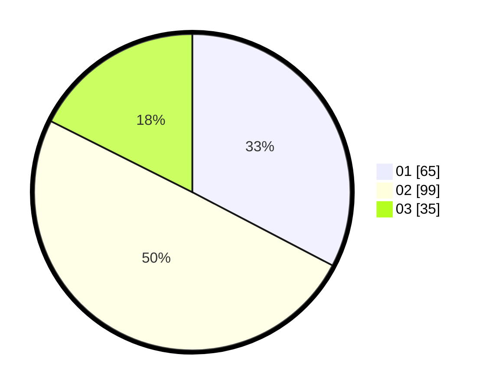

# Hasil

Hasil perolehan suara paslon dapat dilihat pada file paslon-01.txt, paslon-02.txt, dan paslon-03.txt.

Jika tidak ada, artinya data tersebut belum ada pada SIREKAP.

## Perolehan Suara

 * Paslon 01: **65**.
 * Paslon 02: **99**.
 * Paslon 03: **35**.

## Foto C Plano

https://sirekap-obj-formc.kpu.go.id/58b5/pemilu/ppwp/31/73/06/10/02/3173061002216-20240215-004023--27cf228a-0015-4b19-b9cc-32569d7c63bc.jpg

https://sirekap-obj-formc.kpu.go.id/58b5/pemilu/ppwp/31/73/06/10/02/3173061002216-20240215-004148--7e9557b4-97e4-4136-a7fd-10fcd9268067.jpg

https://sirekap-obj-formc.kpu.go.id/58b5/pemilu/ppwp/31/73/06/10/02/3173061002216-20240215-004058--6d180cc0-70b7-4add-979d-cdf483891531.jpg

## DATA PEMILIH TETAP

Jumlah pemilih dalam DPT: **255**.
 * L: **126**.
 * P: **129**.

## DATA PENGGUNA HAK PILIH

Jumlah pengguna hak pilih dalam DPT: **199**.
 * L: **97**.
 * P: **102**.

Jumlah pengguna hak pilih dalam DPTb: **0**.
 * L: **0**.
 * P: **0**.

Jumlah pengguna hak pilih dalam DPK: **3**.
 * L: **1**.
 * P: **2**.

Jumlah pengguna hak pilih: **202**.
 * L: **98**.
 * P: **104**.

## JUMLAH SUARA SAH DAN TIDAK SAH

JUMLAH SELURUH SUARA SAH: **199**.

JUMLAH SUARA TIDAK SAH: **3**.

JUMLAH SELURUH SUARA SAH DAN SUARA TIDAK SAH: **202**.
