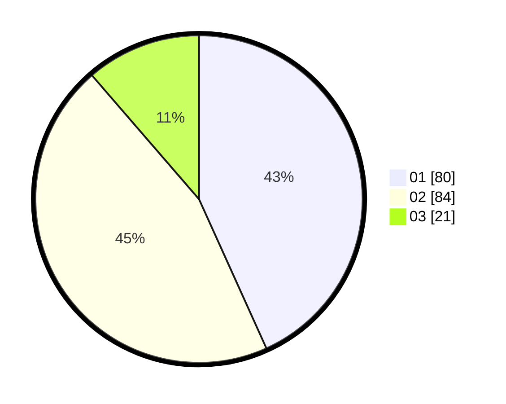

# Hasil

Hasil perolehan suara paslon dapat dilihat pada file paslon-01.txt, paslon-02.txt, dan paslon-03.txt.

Jika tidak ada, artinya data tersebut belum ada pada SIREKAP.

## Perolehan Suara

 * Paslon 01: **80**.
 * Paslon 02: **84**.
 * Paslon 03: **21**.

## Foto C Plano

https://sirekap-obj-formc.kpu.go.id/ced0/pemilu/ppwp/31/73/06/10/02/3173061002217-20240214-155054--c156cfbc-dfd2-44e7-a84e-0ff5485d616a.jpg

https://sirekap-obj-formc.kpu.go.id/ced0/pemilu/ppwp/31/73/06/10/02/3173061002217-20240214-155607--271d2bad-bff6-491e-9a0a-ab10f7d629d8.jpg

https://sirekap-obj-formc.kpu.go.id/ced0/pemilu/ppwp/31/73/06/10/02/3173061002217-20240214-155242--dedfba1a-5da5-4547-898b-b654d10f85d3.jpg

## DATA PEMILIH TETAP

Jumlah pemilih dalam DPT: **248**.
 * L: **115**.
 * P: **133**.

## DATA PENGGUNA HAK PILIH

Jumlah pengguna hak pilih dalam DPT: **186**.
 * L: **82**.
 * P: **104**.

Jumlah pengguna hak pilih dalam DPTb: **0**.
 * L: **0**.
 * P: **0**.

Jumlah pengguna hak pilih dalam DPK: **5**.
 * L: **1**.
 * P: **4**.

Jumlah pengguna hak pilih: **191**.
 * L: **83**.
 * P: **108**.

## JUMLAH SUARA SAH DAN TIDAK SAH

JUMLAH SELURUH SUARA SAH: **185**.

JUMLAH SUARA TIDAK SAH: **6**.

JUMLAH SELURUH SUARA SAH DAN SUARA TIDAK SAH: **191**.
