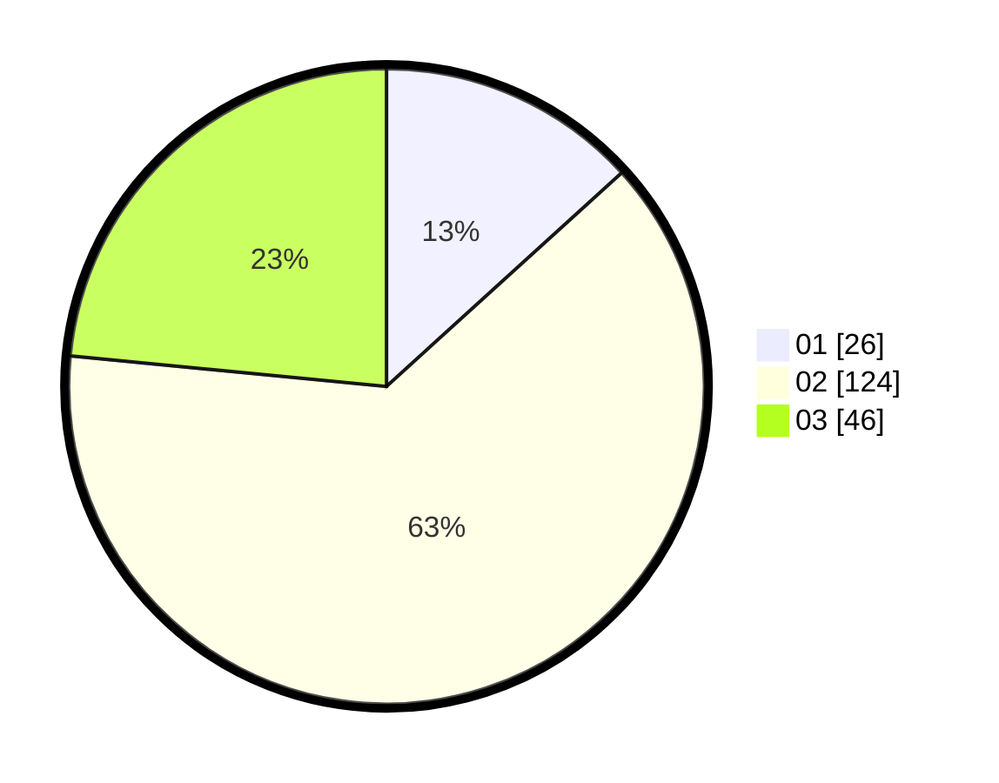

# Hasil

Hasil perolehan suara paslon dapat dilihat pada file paslon-01.txt, paslon-02.txt, dan paslon-03.txt.

Jika tidak ada, artinya data tersebut belum ada pada SIREKAP.

## Perolehan Suara

 * Paslon 01: **26**.
 * Paslon 02: **124**.
 * Paslon 03: **46**.

## Foto C Plano

https://sirekap-obj-formc.kpu.go.id/8bf7/pemilu/ppwp/31/73/06/10/02/3173061002220-20240214-210956--362d308a-49a5-49b2-8e5d-b832c6bda4da.jpg

https://sirekap-obj-formc.kpu.go.id/8bf7/pemilu/ppwp/31/73/06/10/02/3173061002220-20240214-211210--5e165744-89d5-4f22-a717-13ae6dd4efe9.jpg

https://sirekap-obj-formc.kpu.go.id/8bf7/pemilu/ppwp/31/73/06/10/02/3173061002220-20240214-211336--6706830c-ffec-4539-b5be-c9be18d115d8.jpg
