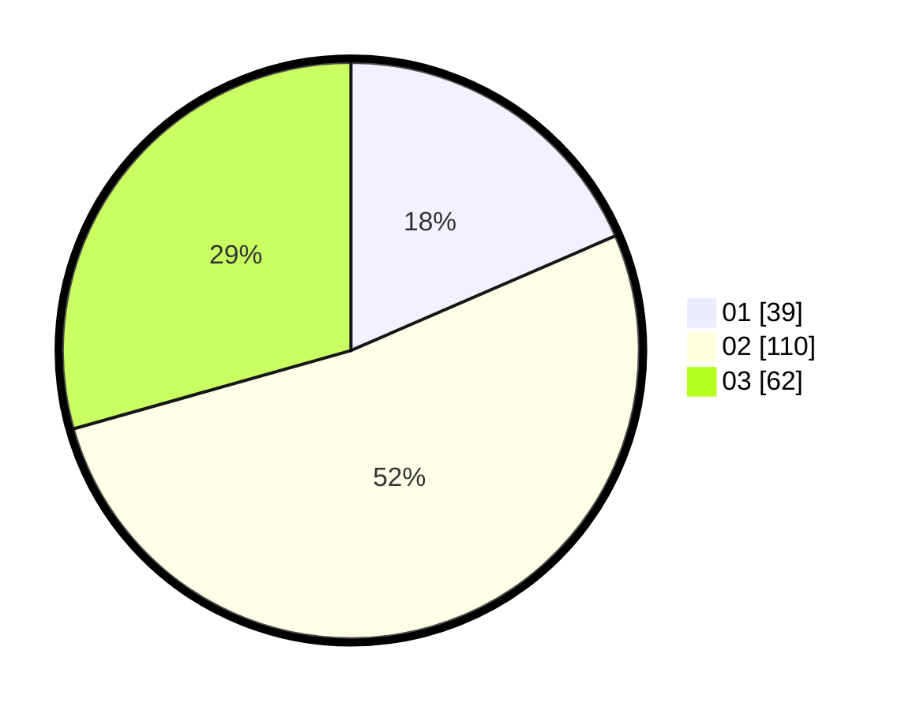

# Hasil

Hasil perolehan suara paslon dapat dilihat pada file paslon-01.txt, paslon-02.txt, dan paslon-03.txt.

Jika tidak ada, artinya data tersebut belum ada pada SIREKAP.

## Perolehan Suara

 * Paslon 01: **39**.
 * Paslon 02: **110**.
 * Paslon 03: **62**.

## Foto C Plano

https://sirekap-obj-formc.kpu.go.id/b68a/pemilu/ppwp/31/73/06/10/02/3173061002221-20240214-193557--66f4f7e7-b8f4-4dcc-8438-d8cb71b82508.jpg

https://sirekap-obj-formc.kpu.go.id/b68a/pemilu/ppwp/31/73/06/10/02/3173061002221-20240214-211417--41cf2247-f579-4a8a-9589-13abac209428.jpg

https://sirekap-obj-formc.kpu.go.id/b68a/pemilu/ppwp/31/73/06/10/02/3173061002221-20240214-195158--790a218e-12f1-40dd-b747-84a7452257a4.jpg

## DATA PEMILIH TETAP

Jumlah pemilih dalam DPT: **264**.
 * L: **146**.
 * P: **118**.

## DATA PENGGUNA HAK PILIH

Jumlah pengguna hak pilih dalam DPT: **214**.
 * L: **122**.
 * P: **92**.

Jumlah pengguna hak pilih dalam DPTb: **0**.
 * L: **0**.
 * P: **0**.

Jumlah pengguna hak pilih dalam DPK: **1**.
 * L: **0**.
 * P: **1**.

Jumlah pengguna hak pilih: **215**.
 * L: **122**.
 * P: **93**.

## JUMLAH SUARA SAH DAN TIDAK SAH

JUMLAH SELURUH SUARA SAH: **211**.

JUMLAH SUARA TIDAK SAH: **4**.

JUMLAH SELURUH SUARA SAH DAN SUARA TIDAK SAH: **215**.
