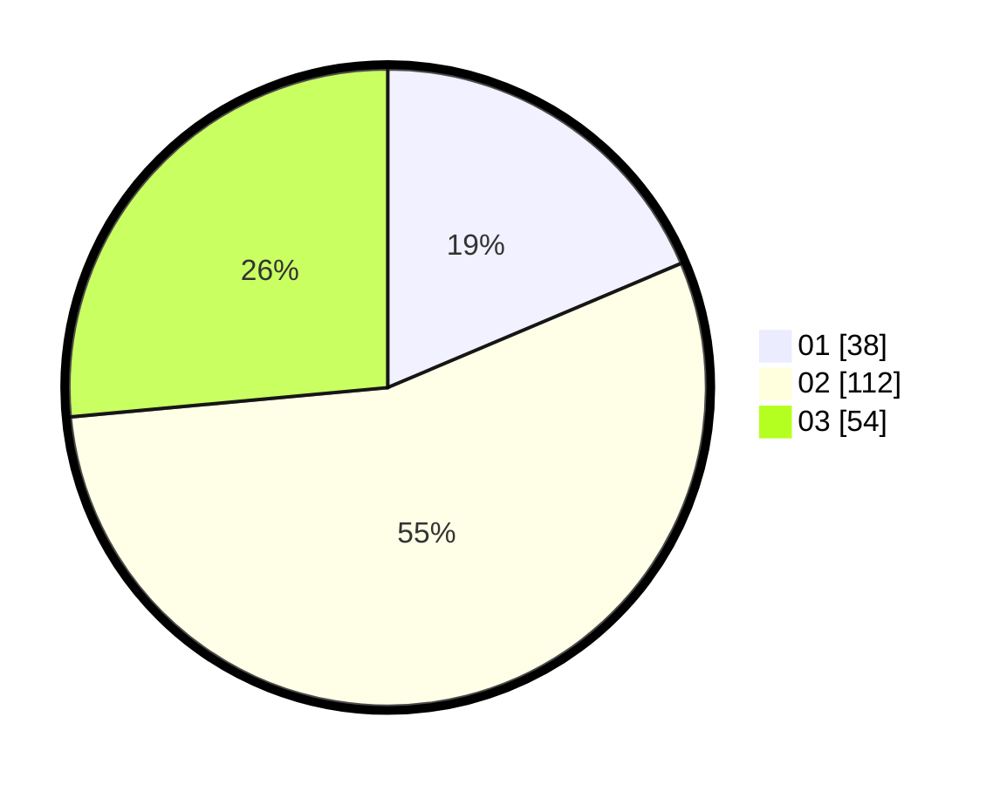

# Hasil

Hasil perolehan suara paslon dapat dilihat pada file paslon-01.txt, paslon-02.txt, dan paslon-03.txt.

Jika tidak ada, artinya data tersebut belum ada pada SIREKAP.

## Perolehan Suara

 * Paslon 01: **38**.
 * Paslon 02: **112**.
 * Paslon 03: **54**.

## Foto C Plano

https://sirekap-obj-formc.kpu.go.id/3ff7/pemilu/ppwp/31/73/06/10/02/3173061002226-20240214-160129--eca55123-da00-4f3a-be86-29118c7b5771.jpg

https://sirekap-obj-formc.kpu.go.id/3ff7/pemilu/ppwp/31/73/06/10/02/3173061002226-20240214-191329--da999407-ff01-4b67-a8c4-c63402d529d9.jpg

https://sirekap-obj-formc.kpu.go.id/3ff7/pemilu/ppwp/31/73/06/10/02/3173061002226-20240214-191457--73da3f92-f348-4caf-90de-75f06b283e6f.jpg

## DATA PEMILIH TETAP

Jumlah pemilih dalam DPT: **265**.
 * L: **139**.
 * P: **126**.

## DATA PENGGUNA HAK PILIH

Jumlah pengguna hak pilih dalam DPT: **201**.
 * L: **100**.
 * P: **101**.

Jumlah pengguna hak pilih dalam DPTb: **6**.
 * L: **1**.
 * P: **5**.

Jumlah pengguna hak pilih dalam DPK: **0**.
 * L: **0**.
 * P: **0**.

Jumlah pengguna hak pilih: **207**.
 * L: **101**.
 * P: **106**.

## JUMLAH SUARA SAH DAN TIDAK SAH

JUMLAH SELURUH SUARA SAH: **204**.

JUMLAH SUARA TIDAK SAH: **3**.

JUMLAH SELURUH SUARA SAH DAN SUARA TIDAK SAH: **207**.
