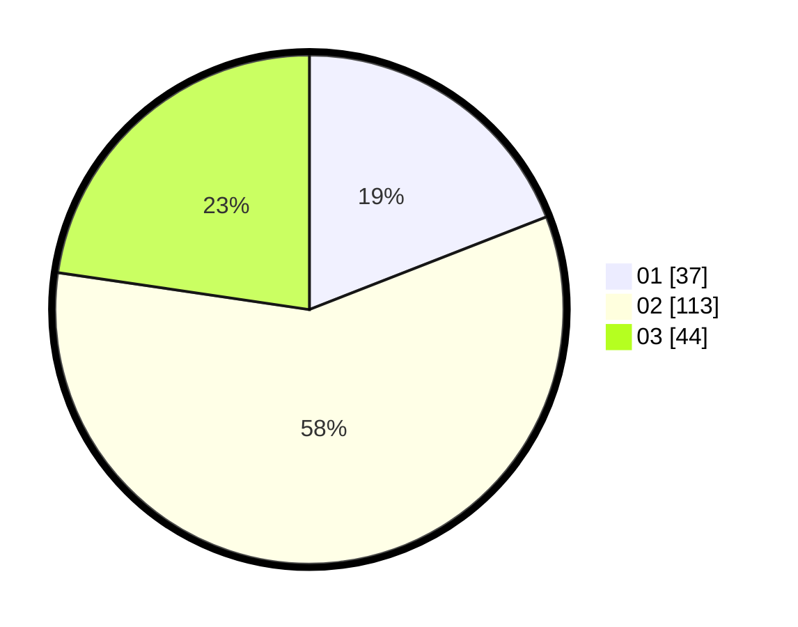

# Hasil

Hasil perolehan suara paslon dapat dilihat pada file paslon-01.txt, paslon-02.txt, dan paslon-03.txt.

Jika tidak ada, artinya data tersebut belum ada pada SIREKAP.

## Perolehan Suara

 * Paslon 01: **37**.
 * Paslon 02: **113**.
 * Paslon 03: **44**.

## Foto C Plano

https://sirekap-obj-formc.kpu.go.id/f213/pemilu/ppwp/31/73/06/10/02/3173061002228-20240214-185317--ad7cc0fd-2a2f-414a-ad2b-7842299f90c2.jpg

https://sirekap-obj-formc.kpu.go.id/f213/pemilu/ppwp/31/73/06/10/02/3173061002228-20240214-190026--f0f55830-2fa9-446e-829c-027b27759e34.jpg

https://sirekap-obj-formc.kpu.go.id/f213/pemilu/ppwp/31/73/06/10/02/3173061002228-20240214-184824--0617c962-385f-45af-abe5-e6d3dd967c48.jpg

## DATA PEMILIH TETAP

Jumlah pemilih dalam DPT: **194**.
 * L: **94**.
 * P: **100**.

## DATA PENGGUNA HAK PILIH

Jumlah pengguna hak pilih dalam DPT: **268**.
 * L: **139**.
 * P: **129**.

Jumlah pengguna hak pilih dalam DPTb: **1**.
 * L: **1**.
 * P: **0**.

Jumlah pengguna hak pilih dalam DPK: **0**.
 * L: **0**.
 * P: **0**.

Jumlah pengguna hak pilih: **269**.
 * L: **140**.
 * P: **129**.

## JUMLAH SUARA SAH DAN TIDAK SAH

JUMLAH SELURUH SUARA SAH: **269**.

JUMLAH SUARA TIDAK SAH: **2**.

JUMLAH SELURUH SUARA SAH DAN SUARA TIDAK SAH: **271**.
