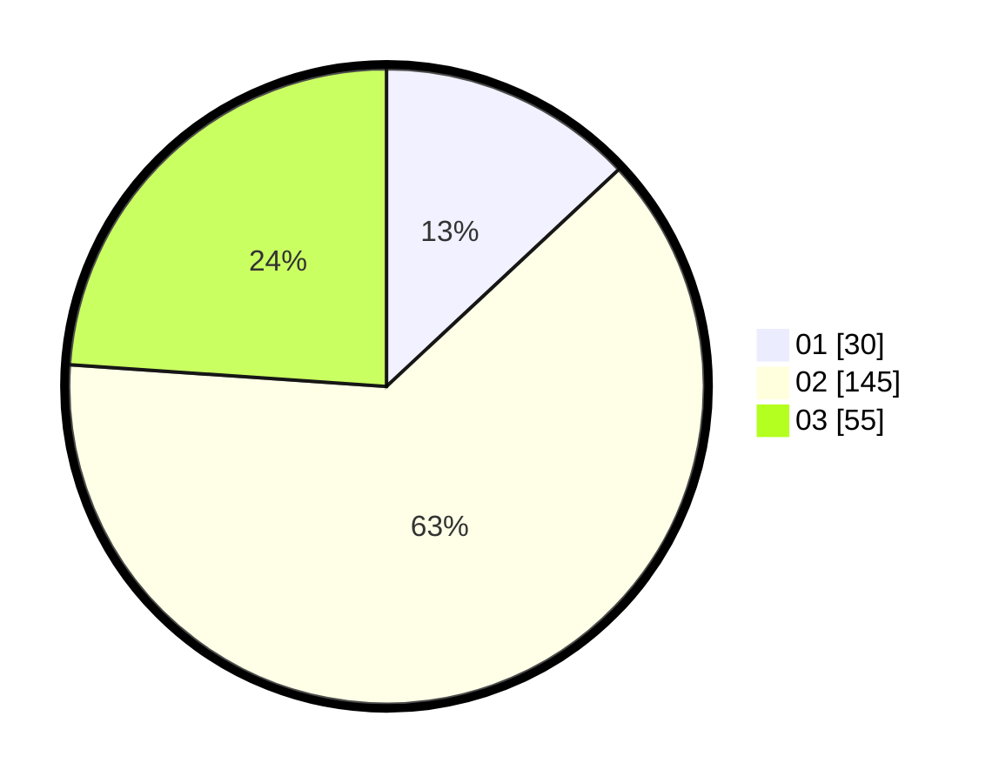

# Hasil

Hasil perolehan suara paslon dapat dilihat pada file paslon-01.txt, paslon-02.txt, dan paslon-03.txt.

Jika tidak ada, artinya data tersebut belum ada pada SIREKAP.

## Perolehan Suara

 * Paslon 01: **30**.
 * Paslon 02: **145**.
 * Paslon 03: **55**.

## Foto C Plano

https://sirekap-obj-formc.kpu.go.id/5016/pemilu/ppwp/31/73/06/10/02/3173061002229-20240214-230508--b3205487-470a-4e2f-8ff1-cc8859348be9.jpg

https://sirekap-obj-formc.kpu.go.id/5016/pemilu/ppwp/31/73/06/10/02/3173061002229-20240214-230543--95f0a685-ed08-470f-9967-ddbb743e613c.jpg

https://sirekap-obj-formc.kpu.go.id/5016/pemilu/ppwp/31/73/06/10/02/3173061002229-20240214-230633--1ecca354-8ddf-4fa4-b4c7-2fa234585a33.jpg
