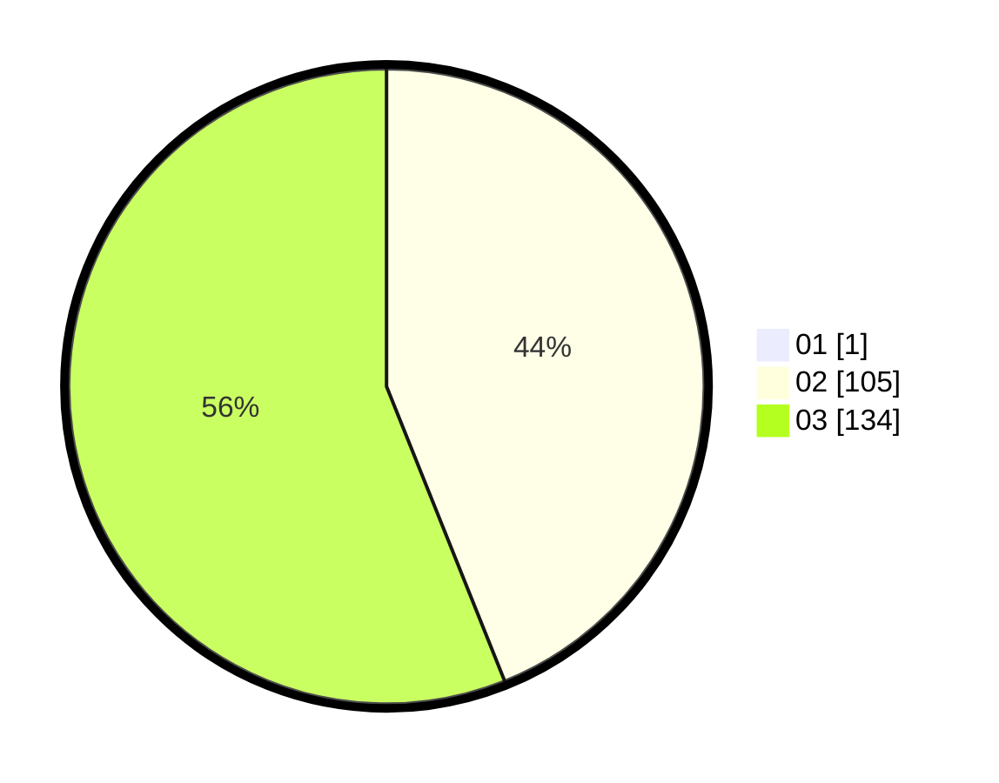

# Hasil

Hasil perolehan suara paslon dapat dilihat pada file paslon-01.txt, paslon-02.txt, dan paslon-03.txt.

Jika tidak ada, artinya data tersebut belum ada pada SIREKAP.

## Perolehan Suara

 * Paslon 01: **1**.
 * Paslon 02: **105**.
 * Paslon 03: **134**.

## Foto C Plano

https://sirekap-obj-formc.kpu.go.id/165f/pemilu/ppwp/31/73/06/10/02/3173061002235-20240214-213717--eab8b003-dcfe-422c-9da2-2dc287bbb548.jpg

https://sirekap-obj-formc.kpu.go.id/165f/pemilu/ppwp/31/73/06/10/02/3173061002235-20240214-185639--fad04257-09cf-4769-9dee-a9caa0693abc.jpg

https://sirekap-obj-formc.kpu.go.id/165f/pemilu/ppwp/31/73/06/10/02/3173061002235-20240214-201320--c6f0bf65-0109-49a0-a7fb-5ff406c52f9e.jpg

## DATA PEMILIH TETAP

Jumlah pemilih dalam DPT: **240**.
 * L: **120**.
 * P: **120**.

## DATA PENGGUNA HAK PILIH

Jumlah pengguna hak pilih dalam DPT: **235**.
 * L: **118**.
 * P: **117**.

Jumlah pengguna hak pilih dalam DPTb: **3**.
 * L: **1**.
 * P: **2**.

Jumlah pengguna hak pilih dalam DPK: **2**.
 * L: **1**.
 * P: **1**.

Jumlah pengguna hak pilih: **240**.
 * L: **120**.
 * P: **120**.

## JUMLAH SUARA SAH DAN TIDAK SAH

JUMLAH SELURUH SUARA SAH: **240**.

JUMLAH SUARA TIDAK SAH: **0**.

JUMLAH SELURUH SUARA SAH DAN SUARA TIDAK SAH: **240**.
