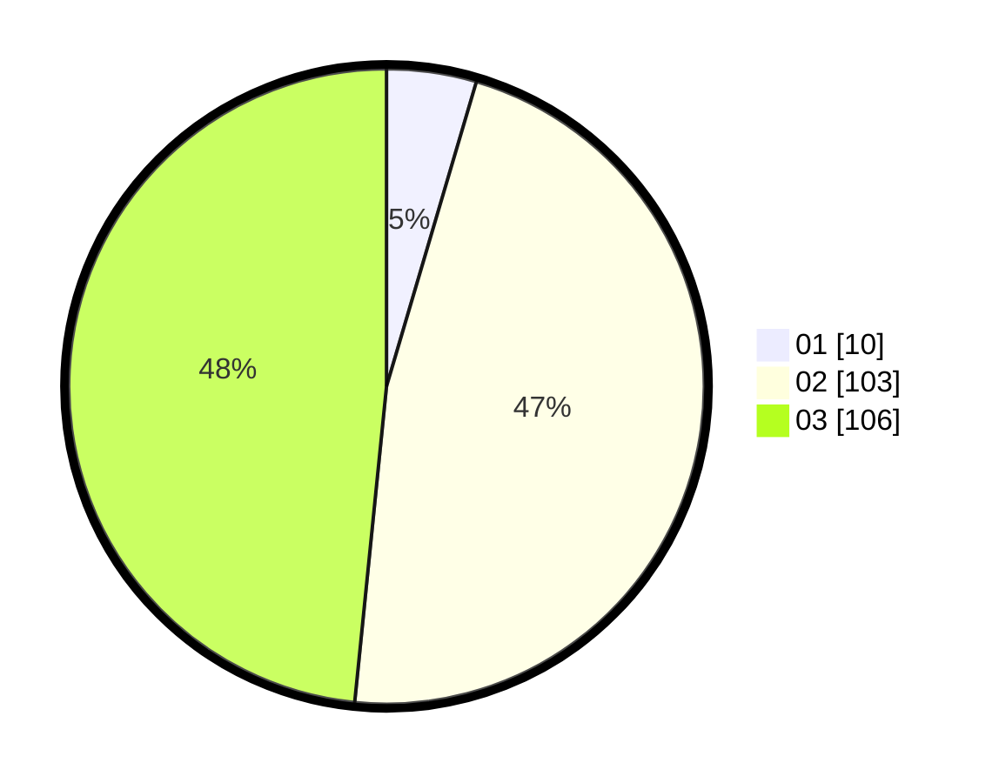

# Hasil

Hasil perolehan suara paslon dapat dilihat pada file paslon-01.txt, paslon-02.txt, dan paslon-03.txt.

Jika tidak ada, artinya data tersebut belum ada pada SIREKAP.

## Perolehan Suara

 * Paslon 01: **10**.
 * Paslon 02: **103**.
 * Paslon 03: **106**.

## Foto C Plano

https://sirekap-obj-formc.kpu.go.id/155d/pemilu/ppwp/31/73/06/10/02/3173061002239-20240215-205117--f4da9123-b90f-4070-bc12-50211efb8aef.jpg

https://sirekap-obj-formc.kpu.go.id/155d/pemilu/ppwp/31/73/06/10/02/3173061002239-20240215-203106--535db8ee-3308-42db-a52f-c330bdcadfaa.jpg

https://sirekap-obj-formc.kpu.go.id/155d/pemilu/ppwp/31/73/06/10/02/3173061002239-20240215-203221--07ca6d53-dade-407f-af62-db68d95569b3.jpg
