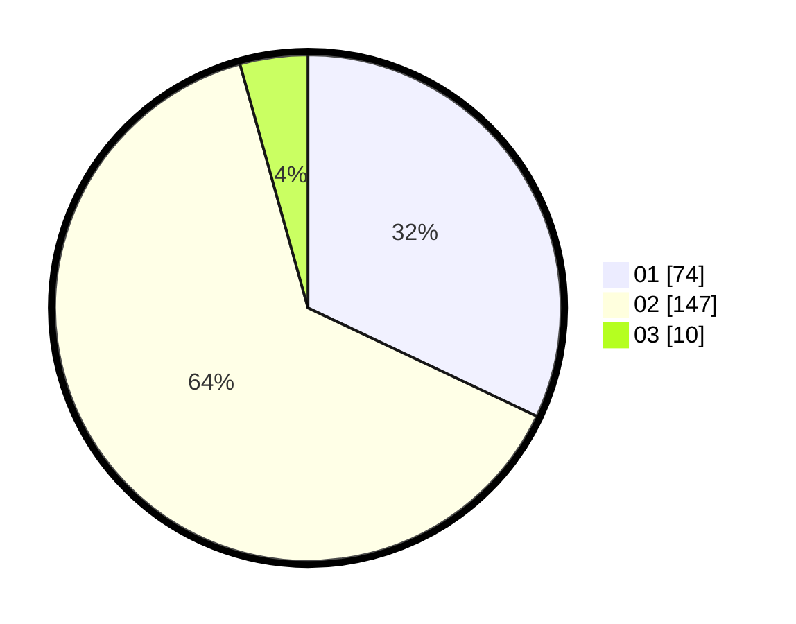

# Hasil

Hasil perolehan suara paslon dapat dilihat pada file paslon-01.txt, paslon-02.txt, dan paslon-03.txt.

Jika tidak ada, artinya data tersebut belum ada pada SIREKAP.

## Perolehan Suara

 * Paslon 01: **74**.
 * Paslon 02: **147**.
 * Paslon 03: **10**.

## Foto C Plano

https://sirekap-obj-formc.kpu.go.id/ae30/pemilu/ppwp/31/73/06/10/03/3173061003002-20240214-201248--ab2ac6d0-f020-4152-b076-1fc5ff869606.jpg

https://sirekap-obj-formc.kpu.go.id/ae30/pemilu/ppwp/31/73/06/10/03/3173061003002-20240214-201527--0783935c-26fd-4a69-950b-3325a8efeca8.jpg

https://sirekap-obj-formc.kpu.go.id/ae30/pemilu/ppwp/31/73/06/10/03/3173061003002-20240214-201757--a6807c85-e884-4d26-9eb5-ab911fb83d33.jpg
