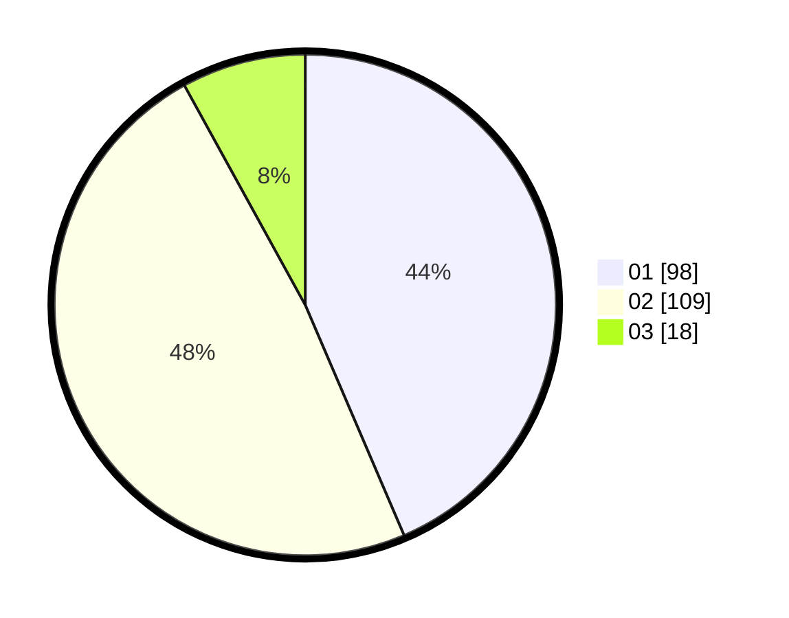

# Hasil

Hasil perolehan suara paslon dapat dilihat pada file paslon-01.txt, paslon-02.txt, dan paslon-03.txt.

Jika tidak ada, artinya data tersebut belum ada pada SIREKAP.

## Perolehan Suara

 * Paslon 01: **98**.
 * Paslon 02: **109**.
 * Paslon 03: **18**.

## Foto C Plano

https://sirekap-obj-formc.kpu.go.id/e491/pemilu/ppwp/31/73/06/10/03/3173061003003-20240215-011105--ebd16ae2-2b5f-44a9-8ec3-004eb03a52a5.jpg

https://sirekap-obj-formc.kpu.go.id/e491/pemilu/ppwp/31/73/06/10/03/3173061003003-20240215-011231--c579c004-7eab-4b0e-81c8-3c98bdd21a29.jpg

https://sirekap-obj-formc.kpu.go.id/e491/pemilu/ppwp/31/73/06/10/03/3173061003003-20240215-011400--8e556abb-cbf7-4eb2-b397-4f382cb75e61.jpg
