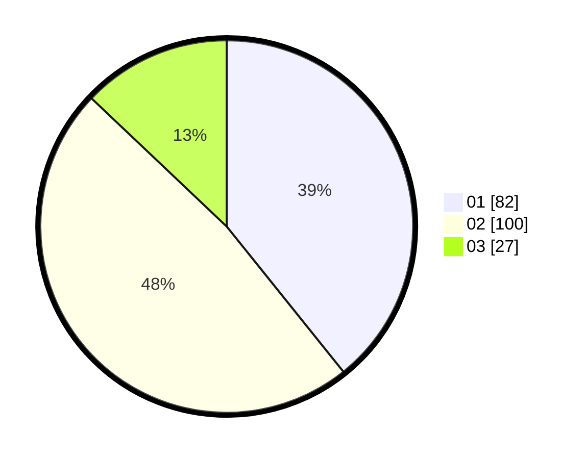

# Hasil

Hasil perolehan suara paslon dapat dilihat pada file paslon-01.txt, paslon-02.txt, dan paslon-03.txt.

Jika tidak ada, artinya data tersebut belum ada pada SIREKAP.

## Perolehan Suara

 * Paslon 01: **82**.
 * Paslon 02: **100**.
 * Paslon 03: **27**.

## Foto C Plano

https://sirekap-obj-formc.kpu.go.id/024f/pemilu/ppwp/31/73/06/10/03/3173061003005-20240215-094252--1be88552-5ce9-4ae0-826c-5e7c50e471bb.jpg

https://sirekap-obj-formc.kpu.go.id/024f/pemilu/ppwp/31/73/06/10/03/3173061003005-20240214-190932--a2724237-950d-47ae-a1e3-b11d24cb3677.jpg

https://sirekap-obj-formc.kpu.go.id/024f/pemilu/ppwp/31/73/06/10/03/3173061003005-20240214-191814--4d009466-1264-48e8-9e0a-5e5237065b49.jpg

## DATA PEMILIH TETAP

Jumlah pemilih dalam DPT: **267**.
 * L: **142**.
 * P: **125**.

## DATA PENGGUNA HAK PILIH

Jumlah pengguna hak pilih dalam DPT: **211**.
 * L: **112**.
 * P: **99**.

Jumlah pengguna hak pilih dalam DPTb: **0**.
 * L: **0**.
 * P: **0**.

Jumlah pengguna hak pilih dalam DPK: **1**.
 * L: **0**.
 * P: **1**.

Jumlah pengguna hak pilih: **212**.
 * L: **112**.
 * P: **100**.

## JUMLAH SUARA SAH DAN TIDAK SAH

JUMLAH SELURUH SUARA SAH: **209**.

JUMLAH SUARA TIDAK SAH: **3**.

JUMLAH SELURUH SUARA SAH DAN SUARA TIDAK SAH: **212**.
