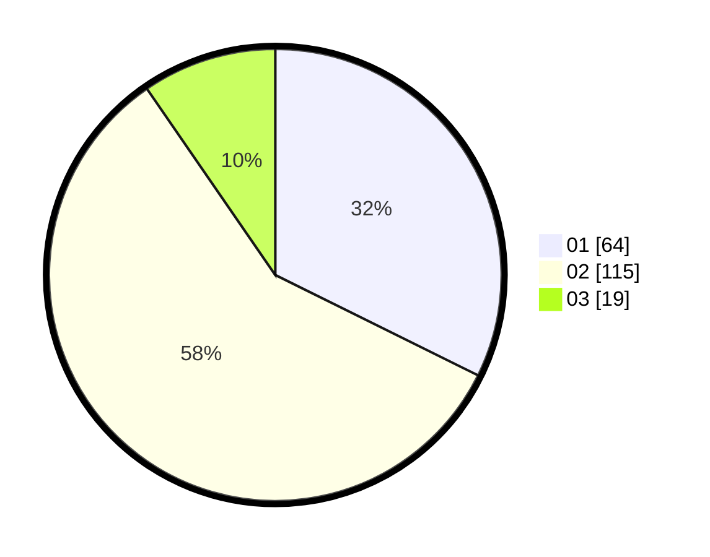

# Hasil

Hasil perolehan suara paslon dapat dilihat pada file paslon-01.txt, paslon-02.txt, dan paslon-03.txt.

Jika tidak ada, artinya data tersebut belum ada pada SIREKAP.

## Perolehan Suara

 * Paslon 01: **64**.
 * Paslon 02: **115**.
 * Paslon 03: **19**.

## Foto C Plano

https://sirekap-obj-formc.kpu.go.id/33a4/pemilu/ppwp/31/73/06/10/03/3173061003007-20240215-125229--33080038-9bd8-4f62-8a53-16e34a003206.jpg

https://sirekap-obj-formc.kpu.go.id/33a4/pemilu/ppwp/31/73/06/10/03/3173061003007-20240214-205607--428877a2-7651-4603-8aa7-a6a46b7c3b26.jpg

https://sirekap-obj-formc.kpu.go.id/33a4/pemilu/ppwp/31/73/06/10/03/3173061003007-20240215-162057--f162f697-2793-4b74-8be5-b1fa25dad78a.jpg
