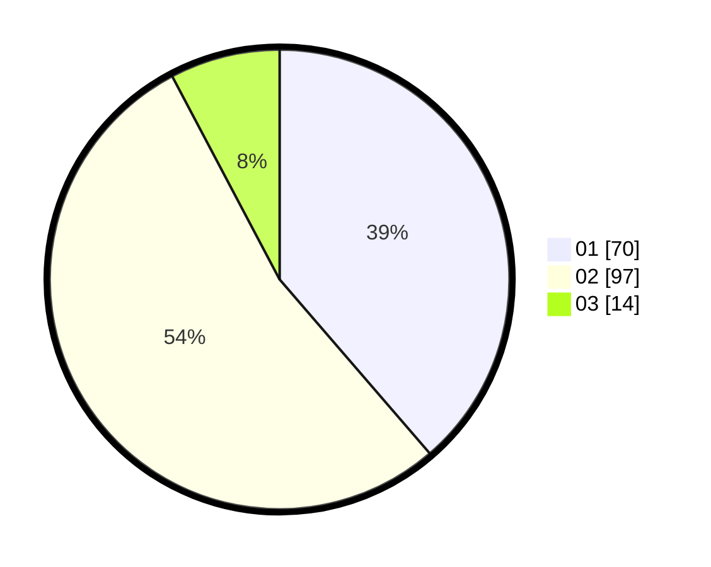

# Hasil

Hasil perolehan suara paslon dapat dilihat pada file paslon-01.txt, paslon-02.txt, dan paslon-03.txt.

Jika tidak ada, artinya data tersebut belum ada pada SIREKAP.

## Perolehan Suara

 * Paslon 01: **70**.
 * Paslon 02: **97**.
 * Paslon 03: **14**.

## Foto C Plano

https://sirekap-obj-formc.kpu.go.id/f54e/pemilu/ppwp/31/73/06/10/03/3173061003009-20240215-125536--b6c70924-fced-40ce-af0a-aba1485bd4c4.jpg

https://sirekap-obj-formc.kpu.go.id/f54e/pemilu/ppwp/31/73/06/10/03/3173061003009-20240215-125558--66aef30e-5a13-4727-a4be-916045f2ad36.jpg

https://sirekap-obj-formc.kpu.go.id/f54e/pemilu/ppwp/31/73/06/10/03/3173061003009-20240215-125547--a14b494d-ff12-4f10-b88f-402f3f6b63e8.jpg

## DATA PEMILIH TETAP

Jumlah pemilih dalam DPT: **238**.
 * L: **120**.
 * P: **118**.

## DATA PENGGUNA HAK PILIH

Jumlah pengguna hak pilih dalam DPT: **185**.
 * L: **90**.
 * P: **95**.

Jumlah pengguna hak pilih dalam DPTb: **0**.
 * L: **0**.
 * P: **0**.

Jumlah pengguna hak pilih dalam DPK: **0**.
 * L: **0**.
 * P: **0**.

Jumlah pengguna hak pilih: **185**.
 * L: **90**.
 * P: **95**.

## JUMLAH SUARA SAH DAN TIDAK SAH

JUMLAH SELURUH SUARA SAH: **181**.

JUMLAH SUARA TIDAK SAH: **4**.

JUMLAH SELURUH SUARA SAH DAN SUARA TIDAK SAH: **185**.
