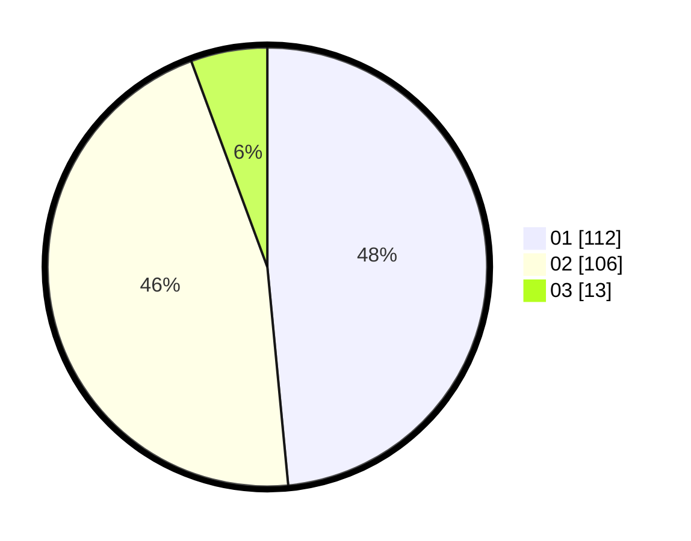

# Hasil

Hasil perolehan suara paslon dapat dilihat pada file paslon-01.txt, paslon-02.txt, dan paslon-03.txt.

Jika tidak ada, artinya data tersebut belum ada pada SIREKAP.

## Perolehan Suara

 * Paslon 01: **112**.
 * Paslon 02: **106**.
 * Paslon 03: **13**.

## Foto C Plano

https://sirekap-obj-formc.kpu.go.id/a6b1/pemilu/ppwp/31/73/06/10/03/3173061003010-20240215-010959--43cd4a23-3517-463c-a96b-ec5e5ba3fec6.jpg

https://sirekap-obj-formc.kpu.go.id/a6b1/pemilu/ppwp/31/73/06/10/03/3173061003010-20240215-011101--126b4d30-0bd5-4551-80e9-0af6b7999e24.jpg

https://sirekap-obj-formc.kpu.go.id/a6b1/pemilu/ppwp/31/73/06/10/03/3173061003010-20240215-010833--8a68d50e-34de-40e9-9e97-4ac63e389886.jpg

## DATA PEMILIH TETAP

Jumlah pemilih dalam DPT: **274**.
 * L: **135**.
 * P: **139**.

## DATA PENGGUNA HAK PILIH

Jumlah pengguna hak pilih dalam DPT: **235**.
 * L: **115**.
 * P: **120**.

Jumlah pengguna hak pilih dalam DPTb: **0**.
 * L: **0**.
 * P: **0**.

Jumlah pengguna hak pilih dalam DPK: **1**.
 * L: **0**.
 * P: **1**.

Jumlah pengguna hak pilih: **236**.
 * L: **115**.
 * P: **121**.

## JUMLAH SUARA SAH DAN TIDAK SAH

JUMLAH SELURUH SUARA SAH: **231**.

JUMLAH SUARA TIDAK SAH: **5**.

JUMLAH SELURUH SUARA SAH DAN SUARA TIDAK SAH: **236**.
