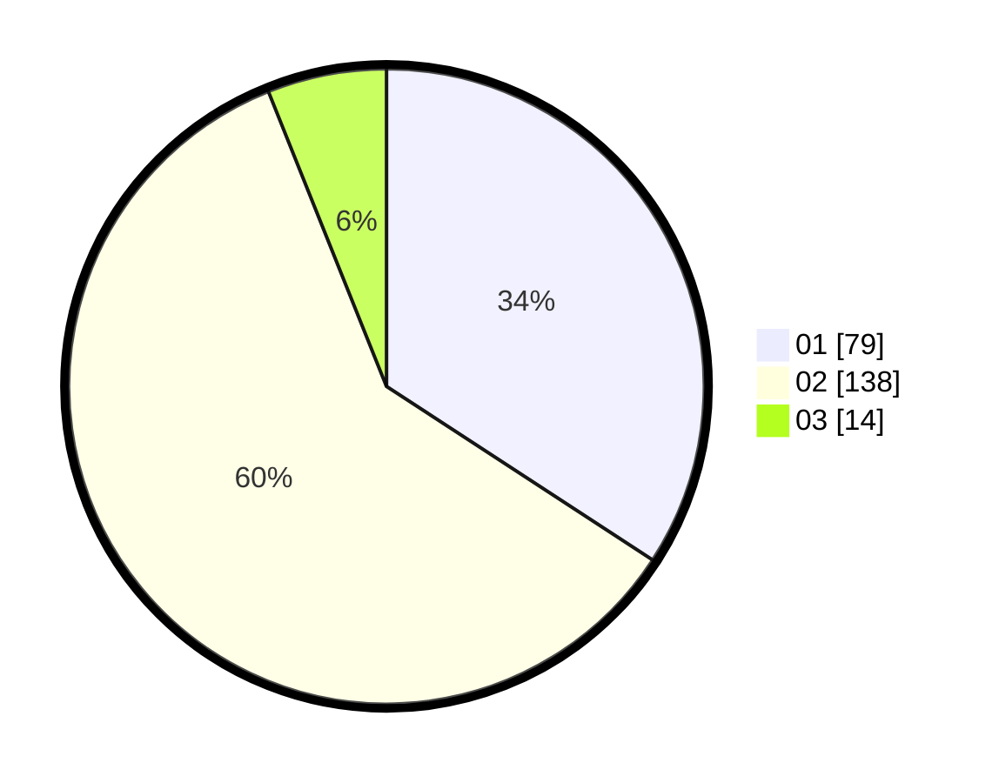

# Hasil

Hasil perolehan suara paslon dapat dilihat pada file paslon-01.txt, paslon-02.txt, dan paslon-03.txt.

Jika tidak ada, artinya data tersebut belum ada pada SIREKAP.

## Perolehan Suara

 * Paslon 01: **79**.
 * Paslon 02: **138**.
 * Paslon 03: **14**.

## Foto C Plano

https://sirekap-obj-formc.kpu.go.id/f72a/pemilu/ppwp/31/73/06/10/03/3173061003011-20240217-152611--e1bf7e67-a164-4e6f-bd0c-0b6a7c44f51f.jpg

https://sirekap-obj-formc.kpu.go.id/f72a/pemilu/ppwp/31/73/06/10/03/3173061003011-20240217-152614--ab723658-e2e9-4681-9cb9-143604c3ff66.jpg

https://sirekap-obj-formc.kpu.go.id/f72a/pemilu/ppwp/31/73/06/10/03/3173061003011-20240217-152612--fa5035a5-cd76-4209-8de1-33f7d5c1a233.jpg

## DATA PEMILIH TETAP

Jumlah pemilih dalam DPT: **270**.
 * L: **142**.
 * P: **128**.

## DATA PENGGUNA HAK PILIH

Jumlah pengguna hak pilih dalam DPT: **232**.
 * L: **117**.
 * P: **115**.

Jumlah pengguna hak pilih dalam DPTb: **0**.
 * L: **0**.
 * P: **0**.

Jumlah pengguna hak pilih dalam DPK: **0**.
 * L: **0**.
 * P: **0**.

Jumlah pengguna hak pilih: **232**.
 * L: **117**.
 * P: **115**.

## JUMLAH SUARA SAH DAN TIDAK SAH

JUMLAH SELURUH SUARA SAH: **231**.

JUMLAH SUARA TIDAK SAH: **1**.

JUMLAH SELURUH SUARA SAH DAN SUARA TIDAK SAH: **232**.
