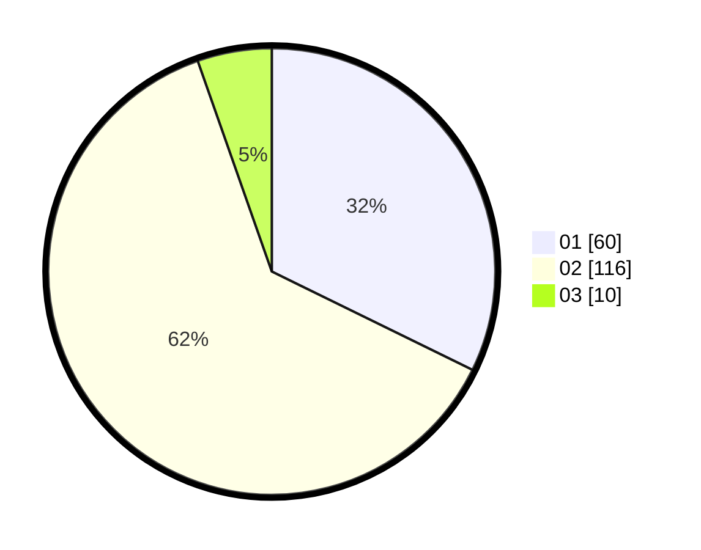

# Hasil

Hasil perolehan suara paslon dapat dilihat pada file paslon-01.txt, paslon-02.txt, dan paslon-03.txt.

Jika tidak ada, artinya data tersebut belum ada pada SIREKAP.

## Perolehan Suara

 * Paslon 01: **60**.
 * Paslon 02: **116**.
 * Paslon 03: **10**.

## Foto C Plano

https://sirekap-obj-formc.kpu.go.id/7724/pemilu/ppwp/31/73/06/10/03/3173061003015-20240214-222742--5703ac67-ba4d-4bb3-a506-02d640da0c05.jpg

https://sirekap-obj-formc.kpu.go.id/7724/pemilu/ppwp/31/73/06/10/03/3173061003015-20240214-222615--8946ac5d-5ac0-481a-99aa-2957aa08c8e9.jpg

https://sirekap-obj-formc.kpu.go.id/7724/pemilu/ppwp/31/73/06/10/03/3173061003015-20240214-223034--3c937678-b41e-41b9-83c6-871a5efa6297.jpg

## DATA PEMILIH TETAP

Jumlah pemilih dalam DPT: **239**.
 * L: **116**.
 * P: **123**.

## DATA PENGGUNA HAK PILIH

Jumlah pengguna hak pilih dalam DPT: **187**.
 * L: **89**.
 * P: **98**.

Jumlah pengguna hak pilih dalam DPTb: **2**.
 * L: **0**.
 * P: **2**.

Jumlah pengguna hak pilih dalam DPK: **0**.
 * L: **0**.
 * P: **0**.

Jumlah pengguna hak pilih: **189**.
 * L: **89**.
 * P: **100**.

## JUMLAH SUARA SAH DAN TIDAK SAH

JUMLAH SELURUH SUARA SAH: **186**.

JUMLAH SUARA TIDAK SAH: **3**.

JUMLAH SELURUH SUARA SAH DAN SUARA TIDAK SAH: **189**.
