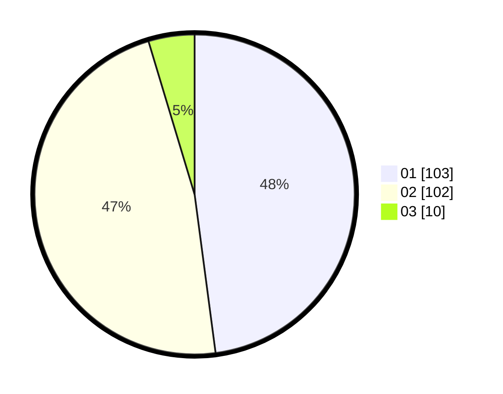

# Hasil

Hasil perolehan suara paslon dapat dilihat pada file paslon-01.txt, paslon-02.txt, dan paslon-03.txt.

Jika tidak ada, artinya data tersebut belum ada pada SIREKAP.

## Perolehan Suara

 * Paslon 01: **103**.
 * Paslon 02: **102**.
 * Paslon 03: **10**.

## Foto C Plano

https://sirekap-obj-formc.kpu.go.id/1116/pemilu/ppwp/31/73/06/10/03/3173061003016-20240215-192236--49813cba-8b5a-48bb-a82c-801c0d0f36a9.jpg

https://sirekap-obj-formc.kpu.go.id/1116/pemilu/ppwp/31/73/06/10/03/3173061003016-20240215-192300--50981167-102c-4585-82e8-aa6a4e95af7f.jpg

https://sirekap-obj-formc.kpu.go.id/1116/pemilu/ppwp/31/73/06/10/03/3173061003016-20240215-192246--625db06a-77b9-4eb4-93ff-5e94faefa8ea.jpg

## DATA PEMILIH TETAP

Jumlah pemilih dalam DPT: **270**.
 * L: **144**.
 * P: **126**.

## DATA PENGGUNA HAK PILIH

Jumlah pengguna hak pilih dalam DPT: **270**.
 * L: **144**.
 * P: **126**.

Jumlah pengguna hak pilih dalam DPTb: **0**.
 * L: **0**.
 * P: **0**.

Jumlah pengguna hak pilih dalam DPK: **0**.
 * L: **0**.
 * P: **0**.

Jumlah pengguna hak pilih: **270**.
 * L: **144**.
 * P: **126**.

## JUMLAH SUARA SAH DAN TIDAK SAH

JUMLAH SELURUH SUARA SAH: **215**.

JUMLAH SUARA TIDAK SAH: **5**.

JUMLAH SELURUH SUARA SAH DAN SUARA TIDAK SAH: **220**.
