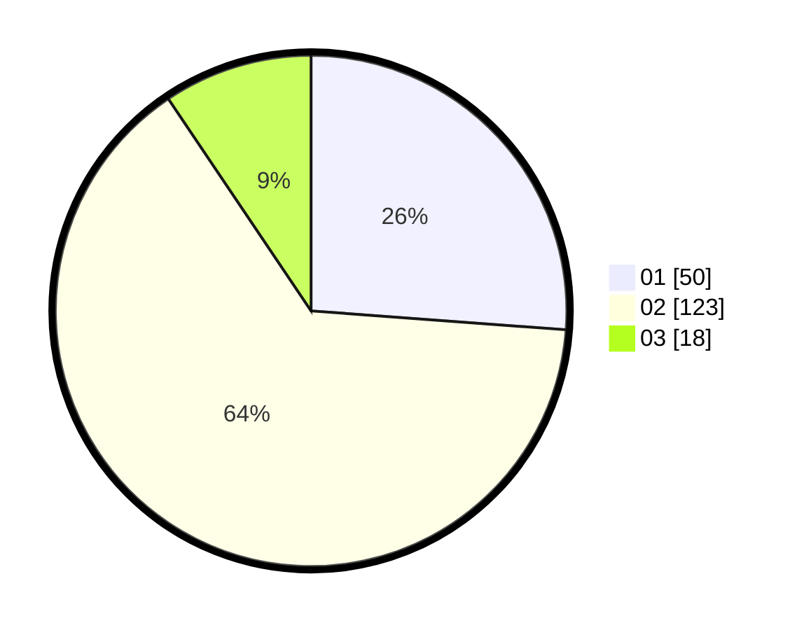

# Hasil

Hasil perolehan suara paslon dapat dilihat pada file paslon-01.txt, paslon-02.txt, dan paslon-03.txt.

Jika tidak ada, artinya data tersebut belum ada pada SIREKAP.

## Perolehan Suara

 * Paslon 01: **50**.
 * Paslon 02: **123**.
 * Paslon 03: **18**.

## Foto C Plano

https://sirekap-obj-formc.kpu.go.id/4388/pemilu/ppwp/31/73/06/10/03/3173061003017-20240214-184657--ec1ed887-335b-4506-b116-d0ec30b40023.jpg

https://sirekap-obj-formc.kpu.go.id/4388/pemilu/ppwp/31/73/06/10/03/3173061003017-20240214-184512--51684f63-bb47-42ef-8edb-0edf94aa5890.jpg

https://sirekap-obj-formc.kpu.go.id/4388/pemilu/ppwp/31/73/06/10/03/3173061003017-20240214-184517--b6f1aebd-4a5d-4116-9521-79bf04e8904b.jpg

## DATA PEMILIH TETAP

Jumlah pemilih dalam DPT: **267**.
 * L: **134**.
 * P: **133**.

## DATA PENGGUNA HAK PILIH

Jumlah pengguna hak pilih dalam DPT: **190**.
 * L: **89**.
 * P: **101**.

Jumlah pengguna hak pilih dalam DPTb: **0**.
 * L: **0**.
 * P: **0**.

Jumlah pengguna hak pilih dalam DPK: **6**.
 * L: **2**.
 * P: **4**.

Jumlah pengguna hak pilih: **196**.
 * L: **92**.
 * P: **104**.

## JUMLAH SUARA SAH DAN TIDAK SAH

JUMLAH SELURUH SUARA SAH: **191**.

JUMLAH SUARA TIDAK SAH: **5**.

JUMLAH SELURUH SUARA SAH DAN SUARA TIDAK SAH: **196**.
